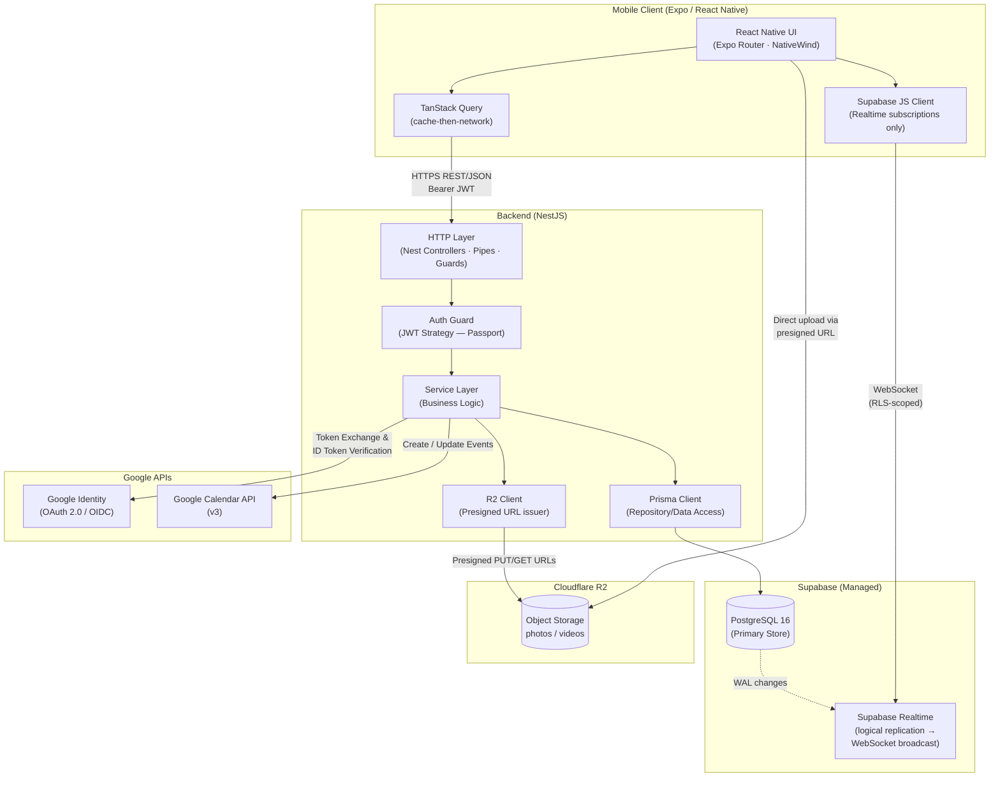
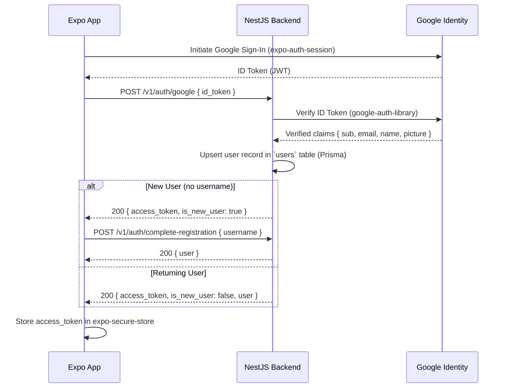
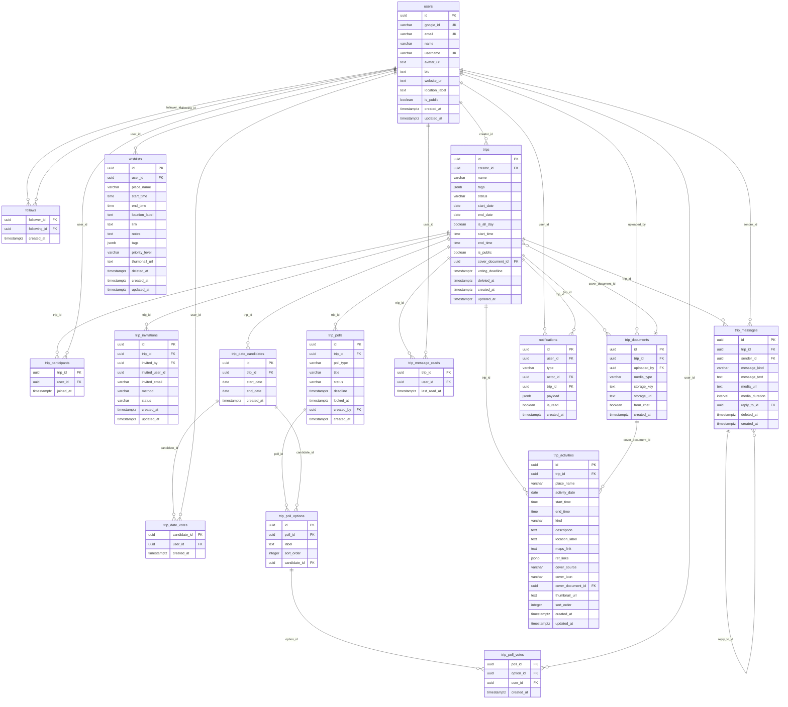
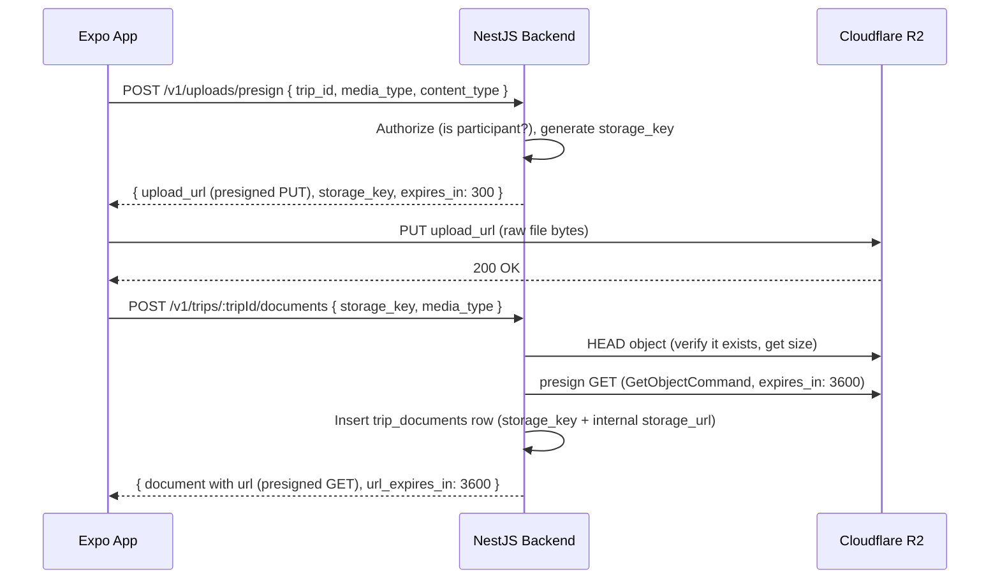

# Architecture Blueprint: Atur Perjalanan

> **Version**: 2.0 — Juli 2026 · **Stack**: Full TypeScript (NestJS + Expo + Supabase Postgres + Cloudflare R2)
>
> **Purpose**: This document is the canonical **target-state** technical reference for AI coding assistants, developers, and automated tooling. It defines the authoritative structure, patterns, and contracts that all generated code, migrations, and scaffolding must conform to. Deviation from this document requires explicit justification.
>
> **This document does NOT track build progress.** It describes what the system *should* look like when fully built, not what has been implemented so far. For current implementation status, what's done, what's next, and in what order — see **[`docs/MILESTONES.md`](MILESTONES.md)**.
>
> **Changelog**: v2.0 migrates the backend from Go/Gin to **NestJS**, mobile from Kotlin Multiplatform to **Expo (React Native)**, adopts **Supabase** as the managed Postgres + Realtime provider, and **Cloudflare R2** for object storage. v1.0 (Go/Gin/KMP) is superseded in full; no v1.0 code patterns should be reused.

---

## Table of Contents

1. [High-Level System Architecture](#1-high-level-system-architecture)
2. [Monorepo Directory Structure](#2-monorepo-directory-structure)
3. [Database Architecture & Schema Strategy](#3-database-architecture--schema-strategy)
4. [Backend Architecture Pattern (NestJS)](#4-backend-architecture-pattern-nestjs)
5. [Mobile Architecture Pattern (Expo / React Native)](#5-mobile-architecture-pattern-expo--react-native)
6. [Realtime Strategy (Supabase Realtime)](#6-realtime-strategy-supabase-realtime)
7. [File Storage Strategy (Cloudflare R2)](#7-file-storage-strategy-cloudflare-r2)

---

## 1. High-Level System Architecture

### 1.1 Component Overview

The system is composed of four primary tiers: the Expo (React Native) mobile client, the NestJS backend, the Supabase-managed PostgreSQL data layer (with Realtime replication), and Cloudflare R2 object storage. All external service interactions (Google OAuth, Google Calendar) are proxied through the backend — the mobile client **never** calls Google APIs directly. The mobile client **does** talk directly to two managed services for latency-sensitive or bandwidth-heavy paths: **Supabase Realtime** (subscribing to live chat/notification changes) and **Cloudflare R2** (uploading media via short-lived presigned URLs issued by the backend).



### 1.2 Request Lifecycle

```
Mobile Client (Expo)
  └─ HTTPS Request (Bearer JWT)
       └─ Nest Router  →  JWT Guard (validate token, attach req.user)
            └─ Controller  (DTO validation via class-validator pipe)
                 └─ Service  (enforce business rules, orchestrate transactions)
                      └─ Prisma Client  (execute parameterized SQL)
                           └─ Supabase PostgreSQL
```

Chat and notification updates additionally flow **out-of-band** of this request/response cycle: once a write commits to `trip_messages` / `notifications`, Supabase Realtime picks up the change from the Postgres write-ahead log and pushes it to any mobile client subscribed to that trip's/user's channel — no polling, no custom WebSocket gateway in NestJS.

### 1.3 Authentication Flow



---

## 2. Monorepo Directory Structure

The repository uses a **Turborepo**-managed monorepo with `pnpm` workspaces. Each top-level subdirectory is an independently buildable unit. Shared tooling and shared TypeScript types live at the root / in a `packages/` workspace.

```
atur-perjalanan/
│
├── .github/
│   └── workflows/
│       ├── backend-ci.yml        # Lint, unit + e2e test, build (NestJS)
│       └── mobile-ci.yml         # Lint, unit test, EAS preview build (Expo)
│
├── backend/                      # NestJS service
│   ├── src/
│   │   ├── main.ts               # Entry point; bootstraps Nest app, global pipes
│   │   ├── app.module.ts         # Root module — imports all feature modules
│   │   ├── config/
│   │   │   └── configuration.ts  # Typed env var loading (@nestjs/config; no hardcoded secrets)
│   │   ├── common/
│   │   │   ├── guards/
│   │   │   │   └── jwt-auth.guard.ts
│   │   │   ├── filters/
│   │   │   │   └── http-exception.filter.ts   # Structured JSON error envelope
│   │   │   ├── interceptors/
│   │   │   │   └── request-id.interceptor.ts
│   │   │   ├── decorators/
│   │   │   │   └── current-user.decorator.ts
│   │   │   └── pipes/
│   │   │       └── validation.pipe.ts
│   │   ├── auth/
│   │   │   ├── auth.module.ts
│   │   │   ├── auth.controller.ts
│   │   │   ├── auth.service.ts
│   │   │   ├── strategies/jwt.strategy.ts
│   │   │   └── dto/
│   │   ├── users/                # profile, search, settings
│   │   │   ├── users.module.ts
│   │   │   ├── users.controller.ts
│   │   │   ├── users.service.ts
│   │   │   └── dto/
│   │   ├── trips/                # trips, invitations, activities, cover
│   │   │   ├── trips.module.ts
│   │   │   ├── trips.controller.ts
│   │   │   ├── trips.service.ts
│   │   │   ├── activities.controller.ts
│   │   │   ├── activities.service.ts
│   │   │   ├── invitations.controller.ts
│   │   │   ├── invitations.service.ts
│   │   │   ├── members.controller.ts
│   │   │   └── dto/
│   │   ├── voting/               # trip_polls (tanggal / aktivitas / lainnya)
│   │   │   ├── voting.module.ts
│   │   │   ├── voting.controller.ts
│   │   │   ├── voting.service.ts
│   │   │   └── dto/
│   │   ├── chat/                 # messages — writes only; realtime is Supabase's job
│   │   │   ├── chat.module.ts
│   │   │   ├── chat.controller.ts
│   │   │   ├── chat.service.ts
│   │   │   └── dto/
│   │   ├── media/                # trip_documents, presigned R2 URLs, cover
│   │   │   ├── media.module.ts
│   │   │   ├── media.controller.ts
│   │   │   ├── media.service.ts
│   │   │   └── dto/
│   │   ├── wishlist/
│   │   │   ├── wishlist.module.ts
│   │   │   ├── wishlist.controller.ts
│   │   │   ├── wishlist.service.ts
│   │   │   └── dto/
│   │   ├── notifications/
│   │   │   ├── notifications.module.ts
│   │   │   ├── notifications.controller.ts
│   │   │   ├── notifications.service.ts
│   │   │   └── notifications.gateway.ts       # writes only; delivery via Supabase Realtime
│   │   ├── jobs/                 # scheduled tasks (@nestjs/schedule)
│   │   │   └── voting-reminder.job.ts
│   │   ├── integrations/
│   │   │   ├── google/
│   │   │   │   ├── google-auth.service.ts     # ID token verification
│   │   │   │   └── google-calendar.service.ts # Calendar API v3 client (M16)
│   │   │   └── r2/
│   │   │       └── r2.service.ts              # Presigned PUT/GET URL issuance
│   │   └── prisma/
│   │       └── prisma.service.ts              # Prisma Client provider (injectable)
│   ├── prisma/
│   │   ├── schema.prisma         # Single source of truth for DB schema
│   │   └── migrations/           # Prisma Migrate — sequential, versioned SQL
│   ├── test/                     # e2e tests (Jest + Supertest)
│   ├── package.json
│   └── tsconfig.json
│
├── mobile/                       # Expo (React Native) project
│   ├── app/                      # Expo Router — file-based routing
│   │   ├── (auth)/               # Splash, onboarding, sign-in, username setup
│   │   ├── (tabs)/                # Beranda, Cari, Buat (+), Wishlist, Profil
│   │   ├── trip/[tripId]/         # Trip detail — Itinerary, Voting, Chat, Media tabs
│   │   └── _layout.tsx
│   ├── src/
│   │   ├── api/                  # Typed API client (openapi-fetch or ts-rest, generated from backend DTOs)
│   │   ├── features/              # Feature-sliced: trips/, wishlist/, chat/, voting/, media/, profile/
│   │   │   └── <feature>/
│   │   │       ├── hooks/         # TanStack Query hooks (useTrips, useTripDetail, ...)
│   │   │       ├── components/
│   │   │       └── types.ts
│   │   ├── realtime/
│   │   │   └── supabaseClient.ts  # Supabase JS client (anon key) — Realtime subscriptions only
│   │   ├── store/                 # Zustand — local/ephemeral UI state (not server state)
│   │   ├── theme/                 # Design tokens mirrored from figma/src/app/components/colors.ts
│   │   └── lib/
│   │       └── secureStorage.ts   # expo-secure-store wrapper for JWT
│   ├── app.json                  # Expo config (EAS project id, scheme, icons)
│   ├── eas.json                  # EAS Build/Submit profiles (M20)
│   ├── package.json
│   └── tsconfig.json
│
├── packages/
│   └── shared-types/              # Shared TS types/DTOs consumed by both backend and mobile
│       ├── src/index.ts
│       └── package.json
│
├── figma/                        # Figma Make export — 125-screen React preview (design reference only)
│   ├── src/app/components/screens/  # Screen3Auth … Screen125DesignTokens
│   └── src/app/components/colors.ts # Canonical design tokens
│
├── docs/
│   ├── BRIEF.md
│   ├── PRD.md
│   ├── WORKFLOW.md
│   ├── ACCEPTANCE_CRITERIA.md
│   ├── FIGMA.md                  # Screen inventory, tokens, API gap analysis
│   ├── MILESTONES.md             # Progress tracking lives here — not in this file
│   └── ARCHITECTURE.md           # This file
│
├── .env.example                  # Template for required env vars (no secrets)
├── supabase/                     # Supabase CLI project (local Postgres, config.toml)
├── turbo.json                    # Turborepo pipeline (build, lint, test, dev)
├── pnpm-workspace.yaml
└── README.md
```

---

## 3. Database Architecture & Schema Strategy

PostgreSQL is provisioned and managed by **Supabase** (either the hosted cloud project for staging/production, or `supabase start` for a local Postgres instance during development). Schema is defined once in `backend/prisma/schema.prisma` and versioned via **Prisma Migrate**; Supabase-specific features (Realtime publication, Row Level Security policies for the client-side Realtime subscriptions) are layered on top via SQL migrations checked into `backend/prisma/migrations/`.

### 3.1 General Rules

| Rule | Specification |
|---|---|
| **Primary Keys** | `UUID v4` (`gen_random_uuid()` at the database layer, mirrored in Prisma as `@default(uuid())`). Avoids sequential ID enumeration attacks. |
| **Timestamps** | All tables include `created_at TIMESTAMPTZ DEFAULT NOW()`. Mutable records also include `updated_at TIMESTAMPTZ DEFAULT NOW()` (Prisma `@updatedAt`). |
| **Soft Deletes** | `trips`, `wishlists`, and `trip_messages` use `deleted_at TIMESTAMPTZ NULL`. All queries **must** filter `WHERE deleted_at IS NULL` (Prisma middleware enforces this globally for these models). Hard delete is used for join/vote rows. |
| **Migrations** | Managed by `prisma migrate dev` (local) / `prisma migrate deploy` (CI/CD). All schema changes are versioned, sequential migration folders. Direct DDL on production is forbidden. |
| **Character Encoding** | `UTF-8` (PostgreSQL `ENCODING 'UTF8'`, Supabase default). |
| **Text Search** | Tag-based filtering uses a `GIN` index on `jsonb` columns. Username/name search uses `pg_trgm` with a `GIN` index (`CREATE EXTENSION pg_trgm;` — enabled in the first migration). |
| **Realtime** | Tables that mobile clients subscribe to directly (`trip_messages`, `notifications`) are added to the `supabase_realtime` publication, and have **Row Level Security (RLS)** policies restricting `SELECT` to trip participants / the notification's own user. See §6. |

### 3.2 Entity-Relationship Overview

This is the **full target schema** — every table the product requires per `docs/WORKFLOW.md` §1–§13, in one diagram.



### 3.3 Table Definitions

#### `users`
```sql
CREATE TABLE users (
    id              UUID PRIMARY KEY DEFAULT gen_random_uuid(),
    google_id       VARCHAR(255) NOT NULL UNIQUE,
    email           VARCHAR(320) NOT NULL UNIQUE,
    name            VARCHAR(255) NOT NULL,
    username        VARCHAR(50)  NOT NULL UNIQUE
                        CHECK (username ~ '^[a-zA-Z0-9_]{3,30}$'),
    avatar_url      TEXT,
    bio             TEXT,
    website_url     TEXT,             -- Screen18EditProfil — social link on profile card
    location_label  TEXT,             -- Screen18EditProfil — pinned location on profile card
    is_public       BOOLEAN NOT NULL DEFAULT TRUE,   -- post-MVP account privacy; MVP: profil publik
    created_at      TIMESTAMPTZ NOT NULL DEFAULT NOW(),
    updated_at      TIMESTAMPTZ NOT NULL DEFAULT NOW()
);

CREATE INDEX idx_users_username_trgm ON users USING GIN (username gin_trgm_ops);
CREATE INDEX idx_users_name_trgm     ON users USING GIN (name gin_trgm_ops);
```

> **Relationship**: 1:N with `trips` (creator), `trip_messages` (sender), `trip_documents` (uploader), `wishlists`, `notifications`. M:N with itself via `follows` (post-MVP).

---

#### `follows` *(schema present, feature post-MVP)*
```sql
CREATE TABLE follows (
    follower_id  UUID NOT NULL REFERENCES users(id) ON DELETE CASCADE,
    following_id UUID NOT NULL REFERENCES users(id) ON DELETE CASCADE,
    created_at   TIMESTAMPTZ NOT NULL DEFAULT NOW(),
    PRIMARY KEY (follower_id, following_id),
    CONSTRAINT no_self_follow CHECK (follower_id <> following_id)
);
```

> Table exists in schema for forward compatibility with a future social layer, but no API surface is exposed for it in MVP (see §4.3.1). `user_follow_counts` view aggregates it for when the feature activates.

```sql
CREATE VIEW user_follow_counts AS
SELECT u.id AS user_id,
       COUNT(DISTINCT f_in.follower_id)  AS followers_count,
       COUNT(DISTINCT f_out.following_id) AS following_count
FROM users u
LEFT JOIN follows f_in  ON f_in.following_id  = u.id
LEFT JOIN follows f_out ON f_out.follower_id  = u.id
GROUP BY u.id;
```

---

#### `trips`
```sql
CREATE TABLE trips (
    id                 UUID PRIMARY KEY DEFAULT gen_random_uuid(),
    creator_id         UUID NOT NULL REFERENCES users(id),
    name               VARCHAR(255) NOT NULL,
    tags               JSONB NOT NULL DEFAULT '[]',
    status             VARCHAR(20) NOT NULL DEFAULT 'voting_pending'
                           CHECK (status IN ('voting_pending', 'fixed')),
    start_date         DATE,
    end_date           DATE,
    is_all_day         BOOLEAN NOT NULL DEFAULT TRUE,
    start_time         TIME,               -- used when is_all_day = false
    end_time           TIME,
    is_public          BOOLEAN NOT NULL DEFAULT FALSE,
    cover_document_id  UUID REFERENCES trip_documents(id) ON DELETE SET NULL,
    voting_deadline    TIMESTAMPTZ,        -- set when created in "candidate" mode; cleared on lock
    deleted_at         TIMESTAMPTZ,
    created_at         TIMESTAMPTZ NOT NULL DEFAULT NOW(),
    updated_at         TIMESTAMPTZ NOT NULL DEFAULT NOW(),
    CONSTRAINT valid_date_range CHECK (
        start_date IS NULL OR end_date IS NULL OR start_date <= end_date
    )
);

CREATE INDEX idx_trips_creator_id ON trips (creator_id) WHERE deleted_at IS NULL;
```

> **Relationship**: 1:N with `users` (creator). M:N via `trip_participants`. 1:N with date candidates, polls, activities, messages, invitations, documents. `cover_document_id` is a nullable FK into `trip_documents` — note the circular reference with `trip_documents.trip_id`; see note below.
>
> **Circular FK note**: `trips.cover_document_id → trip_documents.id` and `trip_documents.trip_id → trips.id` form a cycle. Create `trips` and `trip_documents` without the constraint validated immediately (`DEFERRABLE INITIALLY DEFERRED`), or add the `cover_document_id` FK in a follow-up `ALTER TABLE` after both tables exist. Prisma models this as an optional relation with `onDelete: SetNull`.

---

#### `trip_participants`
```sql
CREATE TABLE trip_participants (
    trip_id   UUID NOT NULL REFERENCES trips(id) ON DELETE CASCADE,
    user_id   UUID NOT NULL REFERENCES users(id) ON DELETE CASCADE,
    joined_at TIMESTAMPTZ NOT NULL DEFAULT NOW(),
    PRIMARY KEY (trip_id, user_id)
);

CREATE INDEX idx_trip_participants_user_id ON trip_participants (user_id);
```

> **Relationship**: Resolves the M:N between `trips` and `users`. The composite PK enforces that a user can only appear once per trip. This table is also the basis for the RLS policy that gates Realtime chat access (§6).

---

#### `trip_invitations`
```sql
CREATE TABLE trip_invitations (
    id              UUID PRIMARY KEY DEFAULT gen_random_uuid(),
    trip_id         UUID NOT NULL REFERENCES trips(id) ON DELETE CASCADE,
    invited_by      UUID NOT NULL REFERENCES users(id),
    invited_user_id UUID REFERENCES users(id) ON DELETE CASCADE,
    invited_email   VARCHAR(320),
    method          VARCHAR(10) NOT NULL CHECK (method IN ('username', 'email')),
    status          VARCHAR(10) NOT NULL DEFAULT 'pending'
                        CHECK (status IN ('pending', 'accepted', 'declined', 'cancelled')),
    created_at      TIMESTAMPTZ NOT NULL DEFAULT NOW(),
    updated_at      TIMESTAMPTZ NOT NULL DEFAULT NOW(),
    CONSTRAINT invitation_target_check CHECK (
        (method = 'username' AND invited_user_id IS NOT NULL) OR
        (method = 'email'    AND invited_email   IS NOT NULL)
    )
);

CREATE INDEX idx_trip_invitations_invited_user ON trip_invitations (invited_user_id)
    WHERE status = 'pending';
CREATE INDEX idx_trip_invitations_trip_id      ON trip_invitations (trip_id);
```

> `status = 'cancelled'` supports the inviter cancelling a pending invite (`Screen41`) — distinct from the invitee declining.

---

#### `trip_date_candidates`
```sql
CREATE TABLE trip_date_candidates (
    id         UUID PRIMARY KEY DEFAULT gen_random_uuid(),
    trip_id    UUID NOT NULL REFERENCES trips(id) ON DELETE CASCADE,
    start_date DATE NOT NULL,
    end_date   DATE NOT NULL,
    created_at TIMESTAMPTZ NOT NULL DEFAULT NOW(),
    CONSTRAINT valid_candidate_range CHECK (start_date <= end_date)
);

CREATE INDEX idx_trip_date_candidates_trip_id ON trip_date_candidates (trip_id);
```

---

#### `trip_date_votes`
```sql
CREATE TABLE trip_date_votes (
    candidate_id UUID NOT NULL REFERENCES trip_date_candidates(id) ON DELETE CASCADE,
    user_id      UUID NOT NULL REFERENCES users(id) ON DELETE CASCADE,
    created_at   TIMESTAMPTZ NOT NULL DEFAULT NOW(),
    PRIMARY KEY (candidate_id, user_id)
);

CREATE INDEX idx_trip_date_votes_user_id ON trip_date_votes (user_id);
```

> **Relationship**: M:N between `trip_date_candidates` and `users`. The composite PK ensures one vote per user per candidate. A `trip_polls` row of `poll_type = 'tanggal'` is auto-created alongside these candidates so the Voting tab can render date voting inside the same multi-poll hub as activity/other polls (see below) — the underlying date-vote tally still reads from `trip_date_candidates` / `trip_date_votes`, not from `trip_poll_votes`, to avoid double-counting.

---

#### `trip_polls`, `trip_poll_options`, `trip_poll_votes` *(WORKFLOW §8 — Voting tab, multi-poll)*
```sql
CREATE TABLE trip_polls (
    id          UUID PRIMARY KEY DEFAULT gen_random_uuid(),
    trip_id     UUID NOT NULL REFERENCES trips(id) ON DELETE CASCADE,
    poll_type   VARCHAR(20) NOT NULL CHECK (poll_type IN ('tanggal', 'aktivitas', 'lainnya')),
    title       VARCHAR(255) NOT NULL,     -- 'tanggal' polls always render as "Tanggal Perjalanan" client-side
    status      VARCHAR(20) NOT NULL DEFAULT 'active'
                    CHECK (status IN ('active', 'locked', 'cancelled', 'expired')),
    deadline    TIMESTAMPTZ,
    locked_at   TIMESTAMPTZ,
    created_by  UUID NOT NULL REFERENCES users(id),
    created_at  TIMESTAMPTZ NOT NULL DEFAULT NOW()
);

CREATE UNIQUE INDEX idx_trip_polls_one_active_per_type
    ON trip_polls (trip_id, poll_type) WHERE status = 'active';

CREATE TABLE trip_poll_options (
    id           UUID PRIMARY KEY DEFAULT gen_random_uuid(),
    poll_id      UUID NOT NULL REFERENCES trip_polls(id) ON DELETE CASCADE,
    label        TEXT NOT NULL,
    sort_order   INTEGER NOT NULL DEFAULT 0,
    candidate_id UUID REFERENCES trip_date_candidates(id)   -- populated only for poll_type = 'tanggal'
);

CREATE TABLE trip_poll_votes (
    poll_id     UUID NOT NULL REFERENCES trip_polls(id) ON DELETE CASCADE,
    option_id   UUID NOT NULL REFERENCES trip_poll_options(id) ON DELETE CASCADE,
    user_id     UUID NOT NULL REFERENCES users(id) ON DELETE CASCADE,
    created_at  TIMESTAMPTZ NOT NULL DEFAULT NOW(),
    PRIMARY KEY (poll_id, user_id)
);
```

> **Rule**: max **one active poll per `poll_type` per trip** (partial unique index) — matches the disabled "Sedang berlangsung" state in `VotingTypeOptionList`. `aktivitas` and `lainnya` polls store their own options/votes in `trip_poll_options`/`trip_poll_votes`; `tanggal` polls are a display wrapper around `trip_date_candidates`/`trip_date_votes` (options reference `candidate_id` instead of storing an independent tally).

---

#### `trip_activities` *(WORKFLOW §7 — Itinerary tab; superseded name for what earlier drafts called `trip_destinations`)*
```sql
CREATE TABLE trip_activities (
    id                UUID PRIMARY KEY DEFAULT gen_random_uuid(),
    trip_id           UUID NOT NULL REFERENCES trips(id) ON DELETE CASCADE,
    place_name        VARCHAR(255) NOT NULL,
    activity_date     DATE,                 -- which itinerary day; must fall within trip date range
    start_time        TIME NOT NULL DEFAULT '09:00',
    end_time          TIME NOT NULL DEFAULT '10:00',
    kind              VARCHAR(20) NOT NULL DEFAULT 'activity'
                          CHECK (kind IN ('gather', 'transport', 'meal', 'activity', 'destination')),
    description       TEXT,
    location_label    TEXT,
    maps_link         TEXT,
    ref_links         JSONB NOT NULL DEFAULT '[]',   -- [{ "url": "...", "label": "..." }]
    cover_source      VARCHAR(20) NOT NULL DEFAULT 'none'
                          CHECK (cover_source IN ('none', 'maps', 'trip_media', 'device', 'icon')),
    cover_icon        VARCHAR(50),          -- icon id, when cover_source = 'icon'
    cover_document_id UUID REFERENCES trip_documents(id) ON DELETE SET NULL,  -- when cover_source = 'trip_media'
    thumbnail_url     TEXT,                 -- resolved via Google Places/Static Maps API from maps_link
    sort_order        INTEGER NOT NULL DEFAULT 0,
    created_at        TIMESTAMPTZ NOT NULL DEFAULT NOW(),
    updated_at        TIMESTAMPTZ NOT NULL DEFAULT NOW(),
    CONSTRAINT valid_activity_time CHECK (start_time <= end_time)
);

CREATE INDEX idx_trip_activities_trip_day ON trip_activities (trip_id, activity_date, start_time);
```

| Figma field (`ActivityDraft`) | Column |
|-------------------------------|--------|
| `title` | `place_name` |
| `startTime` / `endTime` | `start_time` / `end_time` |
| `kind` | `kind` |
| `location` / `mapsPlaceName` | `location_label` |
| `description` | `description` |
| `maps_link` (form) | `maps_link` |
| `refLinks[]` | `ref_links` JSONB |
| `coverSource` / `coverIcon` / `coverUrl` | `cover_source`, `cover_icon`, `thumbnail_url`, `cover_document_id` |

---

#### `trip_messages` *(WORKFLOW §9 — Chat tab; text + media + reply)*
```sql
CREATE TABLE trip_messages (
    id             UUID PRIMARY KEY DEFAULT gen_random_uuid(),
    trip_id        UUID NOT NULL REFERENCES trips(id) ON DELETE CASCADE,
    sender_id      UUID NOT NULL REFERENCES users(id),
    message_kind   VARCHAR(10) NOT NULL DEFAULT 'text'
                       CHECK (message_kind IN ('text', 'photo', 'video')),
    message_text   TEXT,             -- required for 'text', optional caption for 'photo'/'video'
    media_url      TEXT,             -- storage key or legacy URL; API returns presigned GET URL to clients
    media_duration INTERVAL,         -- video only
    reply_to_id    UUID REFERENCES trip_messages(id) ON DELETE SET NULL,
    deleted_at     TIMESTAMPTZ,      -- soft delete; sender-only DELETE endpoint
    created_at     TIMESTAMPTZ NOT NULL DEFAULT NOW(),
    CONSTRAINT message_content_check CHECK (
        (message_kind = 'text'  AND message_text IS NOT NULL) OR
        (message_kind IN ('photo', 'video') AND media_url IS NOT NULL)
    )
);

CREATE INDEX idx_trip_messages_trip_active
    ON trip_messages (trip_id, created_at DESC)
    WHERE deleted_at IS NULL;
```

> **Note**: Partial index `(trip_id, created_at DESC) WHERE deleted_at IS NULL` serves the main chat query: N most recent messages per trip. Long-press delete (`Screen88` — own message) sets `deleted_at`, never a hard delete. `Screen87` (someone else's message) does not show a Hapus option. This table is added to the `supabase_realtime` publication (§6) so mobile clients get new/edited/deleted messages pushed live.

---

#### `trip_message_reads` *(WORKFLOW §9 — unread badge on Chat tab)*
```sql
CREATE TABLE trip_message_reads (
    trip_id      UUID NOT NULL REFERENCES trips(id) ON DELETE CASCADE,
    user_id      UUID NOT NULL REFERENCES users(id) ON DELETE CASCADE,
    last_read_at TIMESTAMPTZ NOT NULL DEFAULT NOW(),
    PRIMARY KEY (trip_id, user_id)
);
```

> Unread count = `COUNT(trip_messages WHERE trip_id = ? AND created_at > last_read_at AND deleted_at IS NULL)`.

---

#### `trip_documents` *(WORKFLOW §10 — Media tab; also chat media and activity/trip covers)*
```sql
CREATE TABLE trip_documents (
    id           UUID PRIMARY KEY DEFAULT gen_random_uuid(),
    trip_id      UUID NOT NULL REFERENCES trips(id) ON DELETE CASCADE,
    uploaded_by  UUID NOT NULL REFERENCES users(id),
    media_type   VARCHAR(10) NOT NULL CHECK (media_type IN ('photo', 'video')),
    storage_key  TEXT NOT NULL,       -- R2 object key, e.g. trips/{tripId}/{uuid}.jpg
    storage_url  TEXT NOT NULL,       -- internal canonical reference (R2_PUBLIC_URL + key); not returned to clients
    from_chat    BOOLEAN NOT NULL DEFAULT FALSE,  -- true when auto-saved from a chat photo/video message
    created_at   TIMESTAMPTZ NOT NULL DEFAULT NOW()
);

CREATE INDEX idx_trip_documents_trip_id ON trip_documents (trip_id, created_at DESC);
```

> Cover selection: `trips.cover_document_id` / `trip_activities.cover_document_id` point at a row here ("Jadikan Cover" — `Screen93`). `from_chat = true` badges the tile in the Media grid when it originated from a chat photo/video message (`Screen94`).

---

#### `notifications`
```sql
CREATE TYPE notification_type AS ENUM (
    'invite', 'follow', 'voting_deadline', 'activity_update'
);

CREATE TABLE notifications (
    id          UUID PRIMARY KEY DEFAULT gen_random_uuid(),
    user_id     UUID NOT NULL REFERENCES users(id) ON DELETE CASCADE,
    type        notification_type NOT NULL,
    actor_id    UUID REFERENCES users(id) ON DELETE SET NULL,
    trip_id     UUID REFERENCES trips(id) ON DELETE CASCADE,
    payload     JSONB NOT NULL DEFAULT '{}',
    is_read     BOOLEAN NOT NULL DEFAULT FALSE,
    created_at  TIMESTAMPTZ NOT NULL DEFAULT NOW()
);

CREATE INDEX idx_notifications_user_unread
    ON notifications (user_id, created_at DESC)
    WHERE is_read = FALSE;
```

**Mapping `notification_type` → UI copy (`Screen9Notifikasi`)**:

| `notification_type` | Copy template | Inline action | `payload` shape |
|---|---|---|---|
| `invite` | `{actor} mengundangmu ke {trip}` | Terima · Tolak | `{ "invitation_id": "uuid" }` |
| `voting_deadline` | `Voting Tanggal {trip} segera berakhir.` | Vote Sekarang → | `{ "poll_type": "tanggal" \| "aktivitas" \| "lainnya" }` |
| `activity_update` | `{actor} menambahkan aktivitas {activity_name} di {trip}.` | Tap → itinerary | `{ "activity_name": "..." }` |
| `follow` | — | — | post-MVP; enum reserved |

This table is also added to the `supabase_realtime` publication (§6) so the notification bell updates live.

---

#### `wishlists`
```sql
CREATE TABLE wishlists (
    id             UUID PRIMARY KEY DEFAULT gen_random_uuid(),
    user_id        UUID NOT NULL REFERENCES users(id) ON DELETE CASCADE,
    place_name     VARCHAR(255) NOT NULL,
    start_time     TIME,
    end_time       TIME,
    location_label TEXT,
    link           TEXT,
    notes          TEXT,
    tags           JSONB NOT NULL DEFAULT '[]',
    priority_level VARCHAR(10) NOT NULL DEFAULT 'medium'
                       CHECK (priority_level IN ('high', 'medium', 'low')),
    thumbnail_url  TEXT,
    deleted_at     TIMESTAMPTZ,
    created_at     TIMESTAMPTZ NOT NULL DEFAULT NOW(),
    updated_at     TIMESTAMPTZ NOT NULL DEFAULT NOW()
);
```

| Figma field | Column | Enum |
|-------------|--------|------|
| `name` | `place_name` | — |
| `startTime` / `endTime` | `start_time` / `end_time` | — |
| `priority` Tinggi/Menengah/Rendah | `priority_level` | `high` / `medium` / `low` |
| `location` | `location_label` | — |
| `link` | `link` | — |
| `notes` | `notes` | — |
| `image` | `thumbnail_url` | resolved or default asset |

### 3.4 Transaction Safety Rules

All operations that mutate more than one table **must** execute inside a Prisma interactive transaction (`prisma.$transaction(async (tx) => { ... })`). Primary examples:

| Operation | Tables mutated in transaction |
|---|---|
| Accept trip invitation (username) | `trip_invitations` (status → `accepted`), `trip_participants` (INSERT) |
| Lock a poll (`tanggal`) | `trips` (dates, `status → fixed`, clear `voting_deadline`), `trip_polls` (`status → locked`, `locked_at`) |
| Create trip with date candidates | `trips` (INSERT), `trip_date_candidates` (bulk INSERT), `trip_polls` + `trip_poll_options` (auto-created `tanggal` poll), set `voting_deadline` |
| Lock a poll (`aktivitas` / `lainnya`) | `trip_polls` (`status → locked`), downstream effects per `poll_type` (e.g. winning option copied into a new `trip_activities` row) |
| Wishlist → trip convert ("Jadikan Perjalanan") | `trips` (INSERT), `trip_activities` (seed day-1 activity), `wishlists` (soft DELETE) — **atomic**, all-or-nothing |
| Set trip/activity cover from media | `trips.cover_document_id` or `trip_activities.cover_document_id` update |
| Calendar event (post-lock) | User-confirmed modal → create event for invitees (M16). Executed as a background job **after** the DB transaction commits — never inline with the HTTP response. |

---

## 4. Backend Architecture Pattern (NestJS)

### 4.1 Layered (Modular) Architecture

NestJS's module system enforces separation by feature domain, with each module internally layered **Controller → Service → Prisma**. Dependencies flow inward only: controllers depend on services; services depend on `PrismaService` and other services (never the reverse).

```
src/main.ts                 — Composition root: bootstrap, global pipes/filters, CORS, Swagger
    │
    ├── *.controller.ts     — HTTP concerns ONLY (route, DTO validation via class-validator, call service)
    │       └── depends on → *.service.ts
    │
    ├── *.service.ts        — Business rules, orchestration, transactions, external API calls
    │       └── depends on → PrismaService + other services (R2Service, GoogleCalendarService, ...)
    │
    └── PrismaService       — Thin wrapper around PrismaClient, injectable, manages connection lifecycle
```

### 4.2 DTO & Validation

Every controller method accepts a typed DTO class decorated with `class-validator` decorators; a global `ValidationPipe` (`whitelist: true, forbidNonWhitelisted: true, transform: true`) strips unknown fields and rejects invalid payloads before the controller body runs.

```typescript
// src/trips/dto/create-trip.dto.ts
import { IsArray, IsBoolean, IsOptional, IsString, MaxLength, ValidateNested } from 'class-validator';
import { Type } from 'class-transformer';

export class DateCandidateDto {
  @IsDateString() start_date: string;
  @IsDateString() end_date: string;
}

export class CreateTripDto {
  @IsString() @MaxLength(255) name: string;
  @IsArray() @IsString({ each: true }) tags: string[];
  @IsOptional() @IsDateString() start_date?: string;
  @IsOptional() @IsDateString() end_date?: string;
  @IsOptional() @IsBoolean() is_all_day?: boolean;
  @IsOptional() @IsArray() @ValidateNested({ each: true }) @Type(() => DateCandidateDto)
  candidates?: DateCandidateDto[];
}
```

DTOs shared verbatim between backend and mobile (response shapes) live in `packages/shared-types` and are imported by both, avoiding drift between what the API returns and what the client expects.

### 4.3 API Versioning & Routing

Base URL: `/v1`. Auth: `Authorization: Bearer <JWT>` unless marked **Public**. Rate limiting: **120 req/min** per IP via `@nestjs/throttler`, applied globally to all `/v1/*` routes (excluded: `/health`).

#### 4.3.1 Route Tree

```
/v1/
├── auth/
│   ├── POST   /google                    # Exchange Google ID token for app JWT
│   └── POST   /complete-registration     # Set username for new users (JWT required)
├── users/
│   ├── GET    /check-username            # Real-time username availability (Public)
│   ├── GET    /search                    # Search users (pg_trgm, cursor paginated)
│   ├── GET    /me                        # Current user profile
│   ├── PUT    /me                        # Update bio, website_url, location_label, is_public
│   ├── DELETE /me                        # Delete account (Screen20)
│   ├── GET    /:username                 # Profile lookup (optional auth)
│   ├── GET    /:username/trips           # Profile trip grid (privacy-aware)
│   ├── POST   /:username/follow          # post-MVP (schema exists, route disabled behind feature flag)
│   └── DELETE /:username/follow          # post-MVP
├── notifications/
│   ├── GET    /                          # cursor paginated
│   ├── GET    /unread-count
│   ├── PUT    /:id/read
│   └── PUT    /read-all
├── trips/
│   ├── GET    /                          # ?tab=upcoming|completed
│   ├── POST   /
│   ├── GET    /invitations               # pending invitations for current user
│   ├── GET    /:tripId
│   ├── PUT    /:tripId
│   ├── DELETE /:tripId                   # soft delete
│   ├── PUT    /:tripId/cover             # { document_id }
│   ├── GET    /:tripId/members
│   ├── DELETE /:tripId/members/:userId   # creator only
│   ├── POST   /:tripId/invitations
│   ├── PUT    /:tripId/invitations/:id   # { accept: boolean }
│   ├── DELETE /:tripId/invitations/:id   # cancel a pending invite (inviter)
│   ├── GET    /:tripId/activities
│   ├── POST   /:tripId/activities
│   ├── PUT    /:tripId/activities/:id
│   ├── DELETE /:tripId/activities/:id
│   ├── GET    /:tripId/polls
│   ├── POST   /:tripId/polls
│   ├── POST   /:tripId/polls/:pollId/vote
│   ├── DELETE /:tripId/polls/:pollId/vote
│   ├── POST   /:tripId/polls/:pollId/lock      # creator only
│   ├── DELETE /:tripId/polls/:pollId
│   ├── GET    /:tripId/messages
│   ├── POST   /:tripId/messages                # { message_kind, message_text?, media_url?, reply_to_id? }
│   ├── PUT    /:tripId/messages/read           # advance read cursor
│   ├── DELETE /:tripId/messages/:messageId     # soft delete, sender only
│   ├── GET    /:tripId/documents
│   ├── POST   /:tripId/documents               # register uploaded R2 object as a document
│   └── DELETE /:tripId/documents/:id
├── uploads/
│   └── POST   /presign                   # { trip_id, media_type, content_type } → { upload_url, storage_key }
├── wishlists/
│   ├── GET    /
│   ├── POST   /
│   ├── PUT    /:id
│   ├── DELETE /:id
│   └── POST   /:id/convert-to-trip       # atomic wishlist → trip conversion
└── integrations/
    └── google-calendar/
        └── POST /events                  # add a confirmed trip to the user's own Google Calendar (M16)
```

#### 4.3.2 Representative Request/Response Contracts

**`POST /v1/auth/google`**
```json
// Request
{ "id_token": "<Google ID token>" }

// Response — new user
{ "access_token": "...", "is_new_user": true }

// Response — returning user
{ "access_token": "...", "is_new_user": false, "user": { "...": "..." } }
```

**`POST /v1/trips`**
```json
{
  "name": "Lombok Weekend Escape",
  "tags": ["#Pantai", "#Alam"],
  "is_all_day": true,
  "start_date": "2026-06-19",
  "end_date": "2026-06-22",
  "candidates": []
}
```

| Mode | Body | DB effect |
|------|------|-----------|
| Tanggal pasti | `start_date` + `end_date`, `candidates` empty | `status = fixed` |
| Kandidat tanggal | `candidates[{start_date, end_date}]` (1–3), dates null | `status = voting_pending`; rows inserted into `trip_date_candidates`; a `tanggal` poll auto-created in `trip_polls`; `voting_deadline = LEAST(created_at + 14d, MIN(candidate.start_date) - 3d)` clamped to `≥ created_at + 7d` |

**`GET /v1/trips?tab=upcoming|completed`** — enriched list response:
```json
[
  {
    "id": "uuid",
    "name": "Lombok Weekend Escape",
    "tags": ["#Pantai", "#Alam"],
    "status": "voting_pending",
    "start_date": null,
    "end_date": null,
    "cover_image_url": "https://<account>.r2.cloudflarestorage.com/trips/.../uuid.jpg?X-Amz-Signature=...",
    "voting_deadline": "2026-06-18T00:00:00Z",
    "participant_count": 4,
    "participants_preview": [{ "id": "uuid", "name": "Rina", "username": "rina_travel", "avatar_url": null }]
  }
]
```

**`GET /v1/notifications`** — embeds `actor` and `trip` summaries (no client-side N+1 fetch):
```json
[
  {
    "id": "uuid",
    "type": "invite",
    "actor": { "id": "uuid", "name": "Rina", "username": "rina_travel", "avatar_url": null },
    "trip": { "id": "uuid", "name": "Raja Ampat Diving Trip" },
    "payload": { "invitation_id": "uuid" },
    "is_read": false,
    "created_at": "2026-07-07T10:00:00Z"
  }
]
```

**`POST /v1/uploads/presign`** — issues a short-lived R2 presigned PUT URL (see §7):
```json
// Request
{ "trip_id": "uuid", "media_type": "photo", "content_type": "image/jpeg" }

// Response
{
  "upload_url": "https://<account>.r2.cloudflarestorage.com/atur-perjalanan/trips/.../<uuid>.jpg?X-Amz-...",
  "storage_key": "trips/<tripId>/<uuid>.jpg",
  "expires_in": 300
}
```

**`GET /v1/trips/:tripId/documents`** — each item includes a presigned GET URL (see §7):
```json
{
  "data": [
    {
      "id": "uuid",
      "storage_key": "trips/<tripId>/<uuid>.jpg",
      "url": "https://<account>.r2.cloudflarestorage.com/...?X-Amz-Signature=...",
      "url_expires_in": 3600,
      "is_cover": false,
      "from_chat": false
    }
  ]
}
```

`POST /v1/trips/:tripId/documents` (register) returns the same `url` + `url_expires_in` shape. Trip list/detail `cover_image_url` and chat `media_url` are also presigned GET URLs — never raw `.r2.dev` or custom-domain public URLs.

**Pagination**: cursor-based everywhere (`?cursor=<RFC3339 timestamp>` or `?cursor=<uuid>` depending on sort column). Default page size 20, max 100. `OFFSET`-based pagination is forbidden.

### 4.4 Authentication Guard

```typescript
// src/common/guards/jwt-auth.guard.ts
@Injectable()
export class JwtAuthGuard extends AuthGuard('jwt') {}

// src/auth/strategies/jwt.strategy.ts
@Injectable()
export class JwtStrategy extends PassportStrategy(Strategy) {
  constructor(config: ConfigService) {
    super({
      jwtFromRequest: ExtractJwt.fromAuthHeaderAsBearerToken(),
      ignoreExpiration: false,
      secretOrKey: config.get<string>('JWT_SECRET'),
    });
  }
  async validate(payload: { sub: string; exp: number }) {
    return { userId: payload.sub }; // attached to req.user
  }
}
```

- JWTs are signed with `HS256` using a secret loaded exclusively from environment variables (`@nestjs/config`).
- Token payload contains only `sub` (user UUID) and `exp`. No sensitive data in the JWT payload.
- Token expiry: **24 hours**. Refresh token strategy is a future iteration.

### 4.5 Database Access via Prisma

```typescript
// src/prisma/prisma.service.ts
@Injectable()
export class PrismaService extends PrismaClient implements OnModuleInit, OnModuleDestroy {
  async onModuleInit() { await this.$connect(); }
  async onModuleDestroy() { await this.$disconnect(); }
}
```

- Connection string (`DATABASE_URL`) points at the Supabase Postgres instance; use the **connection pooling** endpoint (PgBouncer, port `6543`) for the application, and the **direct** connection (port `5432`) for `prisma migrate`.
- Soft-delete filtering (`deleted_at IS NULL`) is enforced via a Prisma Client Extension (`$extends`) applied to the `trip`, `wishlist`, and `tripMessage` models, so it can't be forgotten in an individual query.
- Every service method that talks to the DB accepts standard async/await; Prisma handles connection pooling internally — no manual pool tuning code is needed in application code (pool size is configured via `?connection_limit=` on `DATABASE_URL`).

### 4.6 Performance Rules

| Concern | Rule |
|---|---|
| **N+1 Queries** | Strictly forbidden. Use Prisma `include`/`select` with relations, or batched `findMany({ where: { id: { in: [...] } } })`. Never query inside a loop. |
| **Pagination** | All list endpoints use keyset (cursor-based) pagination, not `OFFSET`/`skip`. Default page size: 20. Maximum: 100. |
| **Google API Calls** | Never synchronously block an HTTP response on a Google API call. Dispatch via a queued job (`@nestjs/bull` + Redis, or a simple in-process async task for MVP scale) after the DB transaction commits. |
| **Rate Limiting** | `@nestjs/throttler` applied globally to `/v1/*`. |
| **Error Responses** | A global `HttpExceptionFilter` always returns `{ "error": { "code": "TRIP_NOT_FOUND", "message": "..." } }`. Never leak stack traces or Prisma error internals to clients. |
| **File uploads** | Never proxy binary upload/download bytes through NestJS. Always issue a presigned R2 URL and let the client talk to R2 directly (§7). |

---

## 5. Client Architecture Pattern (Expo / React Native + react-native-web)

### 5.1 Module Boundaries

```
mobile/
├── app/              # Expo Router — screens, purely presentational + hook composition
├── src/
│   ├── api/          # Typed REST client — no business logic, just HTTP + auth header injection
│   ├── auth/         # AuthProvider (Context) — current user + token, hydrate, signIn/signOut
│   ├── features/     # Feature-sliced domain logic: hooks (TanStack Query) + components
│   ├── realtime/     # Supabase JS client — Realtime channel subscriptions only (no writes)
│   ├── store/        # Zustand — ephemeral/local UI state (e.g. active tab, form drafts)
│   └── theme/        # Design tokens (colors, spacing, typography) mirrored from figma/
```

There is no platform split (no `ios/` vs `android/` business logic) — Expo's managed workflow keeps 100% of application code in TypeScript/React Native shared across all targets. **Web is a first-class target** alongside iOS & Android via `react-native-web`; `app.json` sets `web.output: "single"` (SPA — the app is auth-gated, so no SSR). Native modules are only touched via config plugins in `app.json`; browser-only platform differences (token storage, OAuth redirect) are isolated behind platform files (`.native.ts` / `.web.ts`) selected by Metro.

### 5.2 Data Layer — TanStack Query

TanStack Query (React Query) replaces the earlier "SQLDelight + repository" cache pattern. Each feature exposes typed hooks wrapping the REST client:

```typescript
// src/features/trips/hooks/useTrips.ts
export function useTrips(tab: 'upcoming' | 'completed') {
  return useQuery({
    queryKey: ['trips', tab],
    queryFn: () => api.get<Trip[]>(`/trips?tab=${tab}`),
    staleTime: 30_000,
  });
}
```

- **Cache-then-network** behavior for list endpoints (home trips, wishlist, activities) comes for free from TanStack Query's cache + background refetch-on-mount.
- Persistence across app restarts uses `@tanstack/query-async-storage-persister` backed by `expo-sqlite`'s key-value store or `AsyncStorage`.
- Chat messages use TanStack Query for the initial page load (`GET /trips/:id/messages`) but **live updates come from Supabase Realtime**, not polling or refetch-on-focus (§6) — the Realtime event handler calls `queryClient.setQueryData` to append the new message directly into the cache.
- Auth tokens are stored via a platform-split `TokenStorage` interface (`src/lib/secureStorage.*`, resolved by Metro): **`expo-secure-store`** (iOS Keychain / Android Keystore) on native, and **in-memory + `sessionStorage`** on web — browsers have no keystore, and the `realtime_token` must be JS-readable anyway (Supabase Realtime, §6). **Never** store tokens in AsyncStorage, MMKV without encryption, or the TanStack Query cache. The interface lets an httpOnly-cookie impl drop in later without touching the auth layer.

### 5.3 Navigation

**Expo Router** (file-based) maps directly onto the bottom-nav + stack structure in the Figma screen registry:

```
app/
├── (auth)/
│   ├── splash.tsx
│   ├── onboarding.tsx
│   ├── sign-in.tsx
│   └── username-setup.tsx
├── (tabs)/
│   ├── index.tsx          # Beranda
│   ├── search.tsx          # Cari
│   ├── wishlist.tsx
│   └── profile.tsx
├── trip/
│   ├── create.tsx          # Modal — Buat Perjalanan (the [+] tab action)
│   └── [tripId]/
│       ├── index.tsx       # Itinerary tab (default)
│       ├── voting.tsx
│       ├── chat.tsx
│       ├── media.tsx
│       └── manage.tsx      # Kelola trip (menu ⋮)
└── _layout.tsx
```

### 5.4 Realtime Integration in the Client

```typescript
// src/realtime/useTripChatSubscription.ts
export function useTripChatSubscription(tripId: string) {
  const queryClient = useQueryClient();
  useEffect(() => {
    const channel = supabase
      .channel(`trip-messages-${tripId}`)
      .on('postgres_changes',
        { event: 'INSERT', schema: 'public', table: 'trip_messages', filter: `trip_id=eq.${tripId}` },
        (payload) => {
          queryClient.setQueryData(['messages', tripId], (old: Message[] = []) => [...old, payload.new]);
        })
      .subscribe();
    return () => { supabase.removeChannel(channel); };
  }, [tripId]);
}
```

### 5.5 Dependency Injection / Composition

React Native has no formal DI container; composition is done via React Context providers at the app root (`QueryClientProvider`, an `AuthProvider` exposing the current user + token, and a `SupabaseProvider` exposing the singleton Realtime client), configured once in `app/_layout.tsx`.

---

## 6. Realtime Strategy (Supabase Realtime)

Chat and notifications are **live** without a custom WebSocket gateway in NestJS. NestJS remains the only writer (all inserts/updates go through validated, authorized REST endpoints); Supabase Realtime is purely a **read-side broadcast mechanism** built on Postgres logical replication.

1. **Enable the publication** (one-time migration):
   ```sql
   ALTER PUBLICATION supabase_realtime ADD TABLE trip_messages;
   ALTER PUBLICATION supabase_realtime ADD TABLE notifications;
   ```
2. **Row Level Security (RLS)** must be enabled on both tables so a client subscribing with the Supabase **anon key** only receives rows it's authorized to see — RLS runs server-side inside Supabase regardless of what filter the client subscribes with:
   ```sql
   ALTER TABLE trip_messages ENABLE ROW LEVEL SECURITY;

   CREATE POLICY trip_messages_select_participants ON trip_messages
     FOR SELECT USING (
       trip_id IN (
         SELECT trip_id FROM trip_participants WHERE user_id = auth.uid()
       )
     );
   ```
   Because the app's users are managed by NestJS/Prisma (not Supabase Auth), `auth.uid()` is not populated by a Supabase session. Instead, the mobile client authenticates to Supabase using a **short-lived Supabase-compatible JWT minted by the backend** (signed with the project's JWT secret, containing a `sub` claim equal to the app's internal user UUID) purely so RLS's `auth.uid()` resolves correctly. This token is issued alongside the normal app JWT at `POST /v1/auth/google` / token refresh, and is used **only** to open the Supabase Realtime WebSocket — all REST calls still use the app's own JWT against NestJS.
   ```sql
   CREATE POLICY notifications_select_own ON notifications
     FOR SELECT USING (user_id = auth.uid());
   ```
3. **Mobile subscribes directly** to Supabase Realtime (`src/realtime/`), filtered per trip (chat) or per user (notifications) — see §5.4.
4. **NestJS never needs a `@WebSocketGateway()`.** The `notifications.gateway.ts` file referenced in §2 is a naming convention placeholder for future push-notification fan-out (e.g. Expo push tokens), not a Socket.IO/WS gateway.

**Why this over a custom gateway**: fewer moving parts to scale/monitor, no sticky-session load balancing concerns, and Supabase Realtime already handles reconnect/backoff on the client SDK.

---

## 7. File Storage Strategy (Cloudflare R2)

Cloudflare R2 is used for all trip/chat media (photos, videos) and resolved cover images. R2 was chosen over Firebase Storage because it has a genuinely free, permanent tier (10 GB storage, 1M Class A / 10M Class B operations per month) with **zero egress fees**, which matters once trip media is served back to mobile clients repeatedly. If usage ever needs to exceed the free tier, R2 remains materially cheaper than Firebase Storage at scale because Firebase (Google Cloud Storage) bills egress per GB served; re-evaluate only if R2's 10 GB free storage ceiling becomes a binding constraint before this trade-off changes.

**Flow — direct-to-R2 upload (never proxied through NestJS):**



- Bucket layout: `trips/{tripId}/{uuid}.{ext}` — one bucket for the whole app (`atur-perjalanan-media`), no per-environment bucket needed for MVP scale (use a `staging/` prefix instead if a second environment is needed).
- **Upload (write)**: exclusively via presigned PUT URLs issued by `R2Service` (`expires_in: 300`, 5 minutes), scoped to a single object key.
- **Download (read)**: exclusively via presigned GET URLs issued by `R2Service` (`expires_in: 3600`, 1 hour) when the backend returns media to clients (documents, trip covers, chat media, activity thumbnails). The mobile client **never** fetches objects via R2 public dev URL (`.r2.dev`) or a custom domain — this avoids ISP rate-limits on public dev URLs and works without configuring a custom domain.
- `trip_documents.storage_url` in the DB is an internal canonical reference (`R2_PUBLIC_URL` + key, if set); it is **not** returned to clients. API responses expose `url` (presigned GET) instead.
- The NestJS `R2Service` uses the S3-compatible API (`@aws-sdk/client-s3` + `@aws-sdk/s3-request-presigner`) pointed at `https://<account_id>.r2.cloudflarestorage.com`.
- Chat photo/video messages and Media-tab uploads share the same presign-upload endpoint and bucket; a chat media message additionally inserts a `trip_documents` row with `from_chat = true` so it also appears in the Media tab grid. When listing messages, `media_url` is presigned on the fly from the stored key/URL.

---

## Appendix: Environment Variables

The following environment variables are required by the backend. They must **never** be committed to the repository. Use `.env.example` as a reference template.

| Variable | Description |
|---|---|
| `DATABASE_URL` | Supabase Postgres connection string via connection pooler (`postgres://...:6543/postgres?pgbouncer=true`) |
| `DIRECT_URL` | Supabase Postgres direct connection, used by `prisma migrate` (`postgres://...:5432/postgres`) |
| `SUPABASE_URL` | Supabase project URL (`https://<project>.supabase.co`) |
| `SUPABASE_SERVICE_ROLE_KEY` | Server-side service role key (bypasses RLS — backend only, never shipped to mobile) |
| `SUPABASE_JWT_SECRET` | Used to mint the short-lived Realtime-auth JWT described in §6 |
| `SUPABASE_ANON_KEY` | Public anon key — shipped to the mobile client for Realtime subscriptions |
| `JWT_SECRET` | Random 256-bit secret for signing the app's own auth JWTs |
| `GOOGLE_CLIENT_ID` | OAuth 2.0 Client ID from Google Cloud Console |
| `GOOGLE_CALENDAR_SA_KEY` | Path to Google service account JSON key file |
| `R2_ACCOUNT_ID` | Cloudflare account ID |
| `R2_ACCESS_KEY_ID` / `R2_SECRET_ACCESS_KEY` | R2 API token credentials (scoped to the media bucket only) |
| `R2_BUCKET_NAME` | e.g. `atur-perjalanan-media` |
| `R2_PUBLIC_URL` | *(Optional)* Internal canonical base URL stored in `trip_documents.storage_url`. **Not** used for client-facing media access — clients receive presigned GET URLs instead (§7). |
| `PORT` | HTTP server port (default: `8080`) |
| `APP_ENV` | `development` \| `staging` \| `production` |