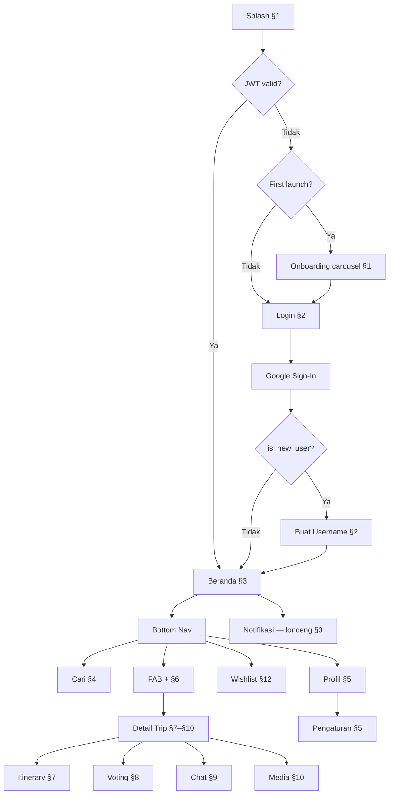

# WorkFlow - Atur Perjalanan

> **Version**: 2.0 — Juli 2026 · Referensi stack (KMP → Expo) dan nomor milestone disesuaikan dengan `docs/MILESTONES.md` v3.0; `trip_destinations` → `trip_activities`. Anotasi ✅/🔜 lama (Go/KMP) dijelaskan ulang sebagai cakupan MVP, bukan status build.

> **Tujuan dokumen ini**: Mendokumentasikan alur kerja pengguna (*user workflows*) dari awal membuka aplikasi hingga menggunakan seluruh fitur. Alur selaras dengan **125 layar high-fidelity** Figma (lihat `docs/FIGMA.md`), **5 tab Bottom Navigation Bar**, **PRD**, dan **kontrak API backend** (`docs/ARCHITECTURE.md §4.3`).

**Preview lokal**: `figma/src/app/App.tsx` — **125 layar**, **§1–§13**. Nomor layar = indeks `Screen{N}` (sequential 1–125). Setiap layar **sekali** di registry.

**Legenda API** (di kolom Interaksi Data):

> **Catatan versi**: Sejak migrasi stack ke NestJS + Expo, backend dibangun langsung menyasar skema/endpoint **penuh** di `docs/ARCHITECTURE.md` §3–§4 (tidak ada lagi tahap "MVP tipis dulu, gap menyusul"). Simbol ✅/🔜 di bawah ini — dan yang tersebar di seluruh dokumen ini — adalah anotasi lama dari rencana Go/KMP; baca ✅ sebagai **"bagian dari cakupan MVP"** dan 🔜 sebagai **"detail yang butuh field/endpoint tambahan dibanding contoh dasar"**, bukan sebagai status pengerjaan aktual. Status pengerjaan sesungguhnya (apa yang sudah/belum dibangun di stack baru) **hanya** ada di `docs/MILESTONES.md`.

| Simbol | Arti |
|--------|------|
| ✅ | Termasuk cakupan MVP — schema & endpoint dasar dirancang di `ARCHITECTURE.md` §3–§4 |
| 🔜 | Butuh field/endpoint tambahan di luar contoh dasar — tetap dalam cakupan MVP, lihat milestone terkait di `MILESTONES.md` |
| — | Client-only (tanpa API) |
| M16 | Google Calendar — milestone terpisah |

Spesifikasi teknis lengkap: `docs/ARCHITECTURE.md` §3 (schema penuh) · §4.3 (route tree lengkap). Status build: `docs/MILESTONES.md`.

---

## Diagram Alur Utama



---

## Peta Preview §1–§13

| § | Judul (App.tsx) | Subtitle (App.tsx) | Accent | Layar |
|---|-----------------|-------------------|--------|-------|
| 1 | Onboarding Layar Awal | Splash · Carousel 4 slide (pengenalan → masalah & solusi per BRIEF) | coral | 1–2 |
| 2 | Autentikasi (Google Sign-In) | Lanjutkan dengan Google · Buat username unik (pengguna baru) | teal | 3–4 |
| 3 | Beranda (Home) — Tab 1 | Tab Mendatang · Selesai · Undangan · Notifikasi · Empty state | coral | 5–9 |
| 4 | Pencarian (Cari) — Tab 2 | Idle · Hasil · Kosong · Profil publik (dari hasil cari) | teal | 10–14 |
| 5 | Profil — Tab 5 | Profil pribadi · Empty trip · Pengaturan · Edit · Bantuan · Hapus akun | coral | 15–20 |
| 6 | Pembuatan Perjalanan | FAB [+] | teal | 21–41 |
| 7 | Detail — Itinerary | Tab trip | coral | 42–55 |
| 8 | Detail — Voting | Tab trip | teal | 56–75 |
| 9 | Detail — Chat | Tab trip | charcoal | 76–92 |
| 10 | Detail — Media | Tab trip | coral | 93–94 |
| 11 | Detail — Kelola Trip | Menu ⋮ | teal | 95–103 |
| 12 | Wishlist | Tab 4 | coral | 104–117 |
| 13 | System States | Global patterns | coral | 118–125 |

> **Mapping PRD ↔ WORKFLOW**: PRD §1 = WORKFLOW §1 + §2 · PRD §2 = WORKFLOW §3 · PRD §3 = WORKFLOW §4 · PRD §4 = WORKFLOW §5. Gunakan **nomor WORKFLOW** + `App.tsx` registry.

---

## Struktur Navigasi Utama (Bottom Tab Bar)

Aplikasi menggunakan *Bottom Navigation Bar* dengan 5 menu (`figma/src/app/components/BottomNav.tsx`):

| Posisi | Label | Fungsi | Workflow |
|--------|-------|--------|----------|
| 1 | **Beranda** | Daftar perjalanan (tab Mendatang / Selesai / Undangan) | §3 |
| 2 | **Cari** | Pencarian pengguna lain | §4 |
| 3 | **[+]** | FAB tengah — buat perjalanan baru | §6 |
| 4 | **Wishlist** | Wishlist aktivitas impian | §12 |
| 5 | **Profil** | Halaman akun pengguna + pengaturan | §5 |

**Entry point global**: ikon lonceng di header Beranda → `Screen9Notifikasi` (digroup di §3 preview).

---

## Panduan Implementasi §1–§3 (AI Agent BE & FE)

> **Baca dokumen ini + section §1–§3 di bawah** sebelum mengimplementasikan backend (M3–M10) atau mobile (M16–M15). Spesifikasi teknis kontrak API: `docs/ARCHITECTURE.md §4.3.1`. Checklist UAT: `docs/ACCEPTANCE_CRITERIA.md §1–§2`.

### Peta dokumen (§1–§3)

| Peran | Dokumen utama | Figma / kode |
|-------|---------------|--------------|
| **FE mobile** | `WORKFLOW.md` §1–§3, `FIGMA.md`, `ACCEPTANCE_CRITERIA.md` §1–§2 | `figma/src/app/components/screens/Screen1*`–`Screen9*` |
| **BE Go** | `ARCHITECTURE.md` §3–§4, `MILESTONES.md` M3–M10 | `backend/internal/handler/`, `backend/internal/service/` |
| **Produk** | `PRD.md` §1–§2, `BRIEF.md` | — |

### State machine navigasi (cold start)

```
Splash (min ~1.5s atau sampai init selesai)
  → JWT valid?  Ya → Beranda §3
  → Tidak → has_completed_onboarding?
       false → Onboarding §1 → Login §2
       true  → Login §2
Login §2 → Google Sign-In → is_new_user?
  true  → Username §2 → Beranda §3
  false → Beranda §3
```

| Keputusan FE | Aturan |
|--------------|--------|
| JWT valid | `access_token` ada + belum expired (24h); verifikasi opsional via `GET /v1/users/me` |
| `is_new_user` | **`true`** dari `POST /auth/google` ATAU user pernah login tapi `username == user.id` (placeholder UUID) |
| Blokir Beranda | Jika `is_new_user` → **wajib** `Screen4Username` dulu (BE tidak memblokir endpoint lain, tanggung jawab FE) |
| Email login | **Jangan tampilkan** tombol `Screen3Auth` di MVP |

### Penyimpanan lokal (FE)

| Key / store | Platform | Isi |
|-------------|----------|-----|
| `access_token` | EncryptedSharedPreferences / Keychain | JWT dari `POST /auth/google` |
| `has_completed_onboarding` | DataStore / UserDefaults | `boolean`, set `true` setelah slide 4 atau tap *Mulai Sekarang* |

### §1–§2 — Kontrak BE (implemented ✅)

**Auth header**: `Authorization: Bearer <access_token>` pada semua `/v1/*` kecuali public.

| Endpoint | Request | Response sukses | Error codes |
|----------|---------|-----------------|-------------|
| `POST /v1/auth/google` | `{id_token}` | `{access_token, is_new_user}` (+ `user` jika returning) | `INVALID_REQUEST` 400, `INVALID_GOOGLE_TOKEN` 401 |
| `POST /v1/auth/complete-registration` | `{username}` + JWT | `{user}` | `INVALID_USERNAME` 400, `USERNAME_TAKEN` 409 |
| `GET /v1/users/check-username?username=` | — | `{available: bool}` | `EMPTY_USERNAME` 400 |

**Username (target desain)**: `^[a-zA-Z0-9_]{3,30}$` · **BE saat ini**: `alphanum` tanpa `_` → **M3–M10 wajib** sebelum rilis.

**Alur FE username**:
1. Debounce 300–500ms pada input → `GET /check-username`
2. `available: true` → border teal + *"Username tersedia"*
3. Tap *Lanjutkan* → `POST /complete-registration` → simpan token → navigasi Beranda
4. Saran chips: generate client-side dari `name` Google (lowercase, strip spasi)

### §3 — Kontrak BE & pola FE

#### Pagination (beda per endpoint!)

| Endpoint | Cursor query | Tipe cursor | Page size default |
|----------|--------------|-------------|-------------------|
| `GET /v1/trips?tab=` | `cursor` | **UUID** (id trip terakhir) | 20 |
| `GET /v1/notifications/` | `cursor` | **RFC3339** (`created_at` item terakhir) | 20 |

#### Muat data Beranda (FE — disarankan)

Saat `HomeScreen` mount, jalankan **paralel**:

```
GET /v1/notifications/unread-count     → badge lonceng
GET /v1/trips?tab=upcoming             → tab Mendatang + counter
GET /v1/trips?tab=completed            → tab Selesai + counter
GET /v1/trips/invitations              → tab Undangan + counter
```

Refresh setelah: terima/tolak undangan, kembali dari create trip, pull-to-refresh.

#### Format `dateRange` di kartu (FE — client-side)

| Kondisi trip | Tampilan (`CreateTripParts.tsx`) |
|--------------|----------------------------------|
| `status == "voting_pending"` | **`"Tanggal sedang divoting"`** (`TRIP_DATE_PENDING`) |
| `status == "fixed"` + dates | `3–7 Jul 2026 · Sepanjang hari` (🔜 jam jika `is_all_day=false` M3–M10) |
| Default cover null | BE resolve `cover_image_url` ke URL default pantai |

#### `participants_preview`

BE mengembalikan max **5** avatar; UI Figma tampilkan max **4** (slice di FE). `participant_count` = total anggota.

#### Terima/Tolak undangan

**Tab Undangan (`Screen8`)** — data lengkap dari `GET /v1/trips/invitations`:

```
PUT /v1/trips/{trip.id}/invitations/{invitation.id}
Body: { "accept": true | false }
Response: 204 No Content
```

**Notifikasi invite (`Screen9`)** — ⚠️ **payload kosong `{}`**, tidak ada `invitation_id`:

1. FE cari di cache/list `GET /v1/trips/invitations` baris dengan `trip.id == notification.trip_id`
2. Pakai `invitation.id` + `trip.id` untuk `PUT` di atas
3. 🔜 M3–M10 BE: tambah `invitation_id` ke payload notif `invite`

**Notifikasi voting** — `actor_id` null; navigasi ke `trip_id` tab Voting.

**Notifikasi aktivitas** — `payload.dest_name`; tap → mark read + navigasi trip Itinerary.

#### Hydration notifikasi (FE — sampai M3–M10 enriched)

Respons `GET /v1/notifications` hanya berisi UUID. FE **wajib** resolve:

| Field | Sumber |
|-------|--------|
| Nama aktor | `actor_id` → cache user / `GET /v1/users/me` jika self / batch fetch |
| Nama trip | `trip_id` → cache dari list trip / `GET /v1/trips/:id` |
| Template teks | Lihat tabel §3 `Screen9Notifikasi` |

#### Error & status HTTP umum §3

| Code | Arti | UI |
|------|------|-----|
| 401 | Token invalid/expired | Redirect login §2 |
| 404 | Trip/invitation tidak ditemukan | Toast error |
| 204 | Mark read / respond invitation sukses | Update state lokal |

### File referensi kode

| Layer | Path |
|-------|------|
| Figma screens §1–§2 | `figma/src/app/components/screens/Screen1Splash.tsx` … `Screen4Username.tsx` |
| Figma screens §3 | `Screen5Home.tsx` … `Screen9Notifikasi.tsx` |
| Figma screens §4–§5 | `Screen10SearchIdle.tsx` … `Screen20SettingsDeleteAccount.tsx` |
| Shared Search | `figma/src/app/components/search/SearchParts.tsx`, `ui/SearchEmptyState.tsx` |
| Shared Profile | `figma/src/app/components/profile/ProfileParts.tsx` |
| Shared Beranda | `figma/src/app/components/home/HomeBerandaParts.tsx`, `ui/EmptyTripsState.tsx`, `ui/TripTags.tsx` |
| Design tokens | `figma/src/app/components/colors.ts` |
| BE auth | `backend/internal/handler/auth_handler.go` |
| BE trips + invitations | `backend/internal/handler/trip_handler.go` |
| BE notifications | `backend/internal/handler/notification_handler.go` |
| Auth token storage (Expo) | `docs/ARCHITECTURE.md §5.2` |

### Gap M3–M10 yang memblokir parity §1–§3

| Prioritas | Item | Dampak |
|-----------|------|--------|
| P0 | Username regex izinkan `_` | `budi_santoso` ditolak BE hari ini |
| P0 | `invitation_id` di payload notif `invite` | Terima/Tolak dari `Screen9` tanpa lookup manual |
| P0 | Enriched notification (`actor`, `trip` embed) | Hindari N+1 fetch di `Screen9` |
| P0 | Trip dates di `GET /invitations` → `trip` | Format tanggal `InvitationCard` |
| P1 | `is_all_day`, `start_time`, `end_time` on trips | Teks `· HH:mm – HH:mm` di kartu |

---

## §1. Onboarding Layar Awal

> **Registry `App.tsx`**: `id: 1` · judul *Onboarding Layar Awal* · subtitle *Splash · Carousel 4 slide (pengenalan → masalah & solusi per BRIEF)* · accent **coral** (`C.coral` `#FF6B6B`)

* **Layar Figma**: `Screen1Splash`, `Screen2EduOnboarding`

### `Screen1Splash`
* **Trigger**: Cold start aplikasi.
* **Visual**: gradient coral (`#FF8A65` → `#FF6B6B` → `#F94E4E`); ikon **kompas** SVG dalam container 156×156 rounded-44; judul *"Atur Perjalanan"*; tagline *"Rencanakan. Jelajahi. Kenang."*; progress bar horizontal + label versi (preview-only).
* **Setelah splash**: jika JWT valid di secure storage → langsung Beranda (§3); jika tidak → cek first-launch.

### `Screen2EduOnboarding`
* **Trigger**: first-launch (`has_completed_onboarding = false` di DataStore lokal).
* Carousel **4 slide** — copy persis dari `SLIDES[]` di `Screen2EduOnboarding.tsx`:

| # | Kind | Judul / Masalah | Body (subtitle / problem / solution) |
|---|------|-----------------|--------------------------------------|
| 1 | intro | *Realisasikan Wacana Liburanmu* | *Janjian "nanti jalan-jalan" sering mandeg? Sepakat jadwal, susun aktivitas, dan update bareng — semuanya di satu trip.* · eyebrow *Selamat datang* · hero + `AppBadge` |
| 2 | pair | Masalah: *Sepakat Jadwal Susah Banget* → Solusi: *Vote Bareng, Hasil Jelas* | Problem: *Minggu ini sibuk, minggu depan juga — poll di chat udah puluhan, tapi tanggal liburan tetap nggak pernah keputusan.* · Solution: *Ajukan beberapa opsi tanggal, semua anggota vote di satu tempat, lihat mana yang paling banyak suara, lalu kunci.* · `MiniVotingPreview` |
| 3 | pair | Masalah: *Rencana Berserakan, Urutan Nggak Jelas* → Solusi: *Timeline Harian yang Jelas* | Problem: *Link TikTok, pin Maps, catatan di Notes — semua ada, tapi nggak ada yang tahu jam berapa berangkat, ke mana dulu, dan makan di mana.* · Solution: *Susun aktivitas berurutan per jam — urutan hari, waktu senggang, dan status jalan semua kelihatan sekilas tanpa tanya-tanya lagi.* · `MiniItineraryPreview` |
| 4 | pair | Masalah: *Chat Trip Kecampur* → Solusi: *Ruang Diskusi Khusus Trip* | Problem: *Ngobrol soal trip masih lewat grup yang sama dengan chat harian — nggak ada ruang khusus, jadi pesan penting tenggelam dan foto liburan susah dilacak lagi.* · Solution: *Grup chat khusus anggota trip — ngobrol, kirim foto, dan semua media otomatis tersimpan rapi di satu tempat.* · `MiniChatPreview` |

* **Layout**: konten scroll penuh; pagination dots **klikable** (sticky di atas CTA); CTA fixed bawah — *"Selanjutnya →"* / *"Mulai Sekarang"* (slide terakhir). **Tanpa** tombol skip.
* Setelah onboarding selesai (set flag) atau bukan first-launch → Autentikasi (§2).
* **Interaksi Data**: — (flag lokal; **tanpa API**)

## §2. Autentikasi (Google Sign-In)

> **Registry `App.tsx`**: `id: 2` · judul *Autentikasi (Google Sign-In)* · subtitle *Lanjutkan dengan Google · Buat username unik (pengguna baru)* · accent **teal** (`C.teal` `#4ECDC4`)

* **Layar Figma**: `Screen3Auth`, `Screen4Username`

### `Screen3Auth`
* Hero ~46%: foto travel + gradient overlay; logo app 52×52 coral; *"Atur Perjalanan"* + tagline *"Rencanakan. Jelajahi. Kenang."*.
* Headline *"Mulai Perjalananmu"*; subtext *"Bergabung dan rencanakan perjalanan seru bersama orang-orang tersayang."*
* **MVP (fungsional)**: **"Lanjutkan dengan Google"** — Warm Coral `#FF6B6B`, tinggi 52, radius 16, ikon Google putih.
* **Post-MVP (desain saja)**: divider *"atau"* + **"Masuk dengan Email"** (outline, tinggi 48) — tidak ada flow/endpoint di MVP; sembunyikan atau nonaktifkan di mobile.
* Footer: *"Dengan melanjutkan, kamu menyetujui **Syarat & Ketentuan** serta **Kebijakan Privasi** kami."* (link coral).
* Upsert profil Google (Email, Nama, Avatar) ke `users`; respons `access_token` + `is_new_user`.

### `Screen4Username`
* **Trigger**: `is_new_user: true` setelah Google login (atau username masih placeholder UUID).
* Judul *"Buat username"*; subtitle *"Ini nama yang akan dilihat teman saat kamu diundang ke perjalanan."*
* Label field *"Username"*; prefix ikon `@`; hint *"Huruf, angka, dan underscore (_) · min. 3 karakter"* (max 30 = aturan BE, tidak ditampilkan di hint Figma).
* Validasi real-time (`GET /check-username`):
  * Aturan: **huruf, angka, underscore (`_`)** · min. 3 · max. 30
  * Tersedia → border teal + ikon `CheckCircle` + *"Username tersedia"* (teal)
  * Taken / invalid → border coral + pesan error inline (mobile; preview Figma = happy path `budi_santoso`)
* **Saran** (chips client-only): contoh `budi_travel`, `budijs`, `budi_explore` — turunan nama Google.
* CTA sticky *"Lanjutkan"* (coral, tinggi 52, radius 14) → `POST /complete-registration` → Beranda (§3).
* Pengguna lama / sudah punya username permanen → skip langsung Beranda.

| Aksi | Method | Endpoint | Status |
|------|--------|----------|--------|
| Login Google | POST | `/v1/auth/google` `{id_token}` → `access_token` + `is_new_user` (+ `user` jika returning) | ✅ |
| Set username | POST | `/v1/auth/complete-registration` `{username}` → `{user}` | ✅ |
| Cek username | GET | `/v1/users/check-username?username=` → `{available}` | ✅ |
| Validasi username `_` | — | Regex `^[a-zA-Z0-9_]{3,30}$` selaras Figma | 🔜 M3–M10 (saat ini BE `alphanum` tanpa `_`) |
| Login email | — | Post-MVP | — |

## §3. Beranda (Home) — Tab 1

> **Registry `App.tsx`**: `id: 3` · judul *3. Beranda (Home) — Tab 1* · subtitle *Tab Mendatang · Selesai · Undangan · Notifikasi · Empty state* · accent **coral** (`C.coral` `#FF6B6B`)

* **Layar Figma**: `Screen5Home`, `Screen6EmptyBeranda`, `Screen7HomeSelesai`, `Screen8HomeUndangan`, `Screen9Notifikasi`
* **Shared components**: `figma/src/app/components/home/HomeBerandaParts.tsx`, `ui/EmptyTripsState.tsx`, `ui/TripTags.tsx`

### Shell & Navigasi
* `HomePageShell` (Screen5–8): safe area 60px + `BottomNav` active=`home` + `HomeScrollBody` padding `20px 22px 112px`, gap 16.
* `Screen9Notifikasi`: **full-page tanpa BottomNav** — `SafeAreaTop` + `PageHeader`; back navigasi ke Beranda.
* Entry global lonceng (`HomeHeader`) → push `Screen9Notifikasi` (bukan modal).

### Header (`HomeHeader` + `NotificationBell`)
* Judul **"Perjalananku"** (font 22/800, padding header `8px 22px 0`) kiri; lonceng kanan.
* Lonceng: container 40×40 `C.light` radius 12; ikon `Bell` 20px charcoal.
* Badge: `unread_count` dari API; coral pill min-width 18, height 18; teks putih 10/800; **9+** jika > 9; hidden jika 0.

### Tab View (`HomeTabs`)
| Tab ID | Label | Data source | Counter |
|--------|-------|-------------|---------|
| `mendatang` | Mendatang | `GET /v1/trips?tab=upcoming&cursor=` | jumlah item tab (atau total pagination) |
| `selesai` | Selesai | `GET /v1/trips?tab=completed&cursor=` | sama |
| `undangan` | Undangan | `GET /v1/trips/invitations` | `invitations.length` |

* Container tabs: margin `16px 22px 0`, border-bottom 1.5px; tab spacing marginRight 18.
* Counter badge selalu tampil (termasuk 0); aktif → label coral 14/700 + pill `coralLight`; inactive → muted 14/500 + pill `light`.
* Tab aktif: border-bottom coral 2.5px.

### `Screen5Home` — Tab Mendatang
* **`TripCard`**: radius 20; shadow `0 4px 24px`; cover **150px** `object-fit: cover`; body padding `14px 16px 16px`.
* Judul trip 16/800; `TripTags` variant=`card` — max **3** chip teal (`tealLight` bg) + **`+N`** overflow; chip format `#Tag`.
* Baris bawah: ikon `Calendar` 13px + `dateRange` 12/muted; stacked avatars 26px, overlap **-9px**, border 2px white (slice max **4** di FE).
* Field API: `cover_image_url`, `name`, `tags[]`, `start_date`/`end_date`/`status`/`voting_deadline`, `participants_preview[]`, `participant_count`.
* Format `dateRange` client-side: `status=voting_pending` → **`"Tanggal sedang divoting"`** (`TRIP_DATE_PENDING`); fixed → `3–7 Jul 2026 · Sepanjang hari` atau `20–24 Agu 2026 · 08:00 – 17:00` (🔜 jam via M3–M10 `is_all_day`).

### `Screen6EmptyBeranda` — Empty Mendatang
* Hanya untuk tab **Mendatang** kosong (tidak ada layar empty terpisah di registry untuk Selesai/Undangan).
* `EmptyTripsState` size=`default`: ilustrasi kompas SVG (`EmptyTripsIllustration` 190×168); judul hardcoded *"Belum ada perjalanan"*; deskripsi prop *"Mulai rencanakan liburan pertamamu bersama teman-teman."*
* CTA `ProfileEmptyTripCta`: **"Buat Perjalanan Baru"** (coral, tinggi 52, radius 16, ikon `Plus`) → navigasi create trip (§6 / FAB).

### `Screen7HomeSelesai` — Tab Selesai
* `TripCard` prop **`dimmed`**: card `opacity: 0.92`; cover `filter: grayscale(20%)`.

### `Screen8HomeUndangan` — Tab Undangan
* **`InvitationCard`**: radius 20; cover **120px** + gradient overlay `linear-gradient(to top, rgba(26,26,46,0.55), transparent 55%)`.
* Overlay teks: *"Diundang oleh **@`inviter.username`**"* (11px putih, bottom 10px).
* Judul trip 15/800; `Calendar` + `dateRange` 12/muted; CTA row gap 8:
  * **Terima**: coral, tinggi **40**, radius 12, 13/700
  * **Tolak**: bg `C.light`, border `1px solid border`, color muted, tinggi 40, radius 12, 13/600
* API: `GET /v1/trips/invitations` → `{ id, trip: {id, name, cover_image_url}, inviter: {id, name, username, avatar_url}, method, status }`.
* Terima/Tolak: `PUT /v1/trips/:tripId/invitations/:id` `{accept: bool}` → 204.
* 🔜 M3–M10: extend `trip` summary dengan `start_date`, `end_date`, `status`, `is_all_day`, `start_time`, `end_time`.

### `Screen9Notifikasi` — Layar Notifikasi
* Bg `C.light`; `PageHeader` judul *"Notifikasi"*; kanan `HeaderTextButton` **"Tandai semua dibaca"** → `PUT /v1/notifications/read-all`.
* List padding `0 16px 24px`, gap 10.
* Kartu: radius **18**; padding **14×16**; shadow `0 3px 16px`; unread → border `1.5px solid coral30` + dot 8px kanan atas; read → border `1px solid border`.
* Layout: avatar aktor 44×44 radius 14 + badge ikon tipe 20×20 (sudut kanan bawah avatar); teks 13/500 + **highlight** 800; timestamp 11/mutedLight.
* Tombol aksi (tinggi **36**, radius **10**, marginTop 12, gap 8):

| Preview (`Screen9Notifikasi.tsx`) | BE `type` | Ikon / bg badge | Teks template | Tombol |
|-----------------------------------|-----------|-----------------|---------------|--------|
| invite #1 | `invite` | ✈️ `coralLight` | *"{nama} mengundangmu ke **{trip}**"* | Terima (coral) · Tolak (outline muted) |
| voting #2 | `voting_deadline` | 🗳️ `#FFF8ED` | *"Voting Tanggal **{trip}** segera berakhir."* | Vote Sekarang → (amber `#F59E0B` on `#FFF8ED`) |
| voting #3 | `voting_deadline` 🔜 `poll_type=destination` | 🗳️ `#FFF8ED` | *"Voting Destinasi **{trip}** deadline besok."* | Vote Sekarang → |
| activity #4 | `destination_update` | 📋 `tealLight` | *"{nama} menambahkan aktivitas **{dest}** di {trip}."* | — (tap kartu → mark read + navigasi trip) |

* `destination_update` payload BE: `{ "dest_name": "..." }`.
* Kartu `actions.length === 0` → `cursor: pointer`; tap = mark read + navigasi trip Itinerary.
* **Hydration client**: BE kirim `actor_id`, `trip_id` (UUID) — FE resolve nama/avatar/trip dari cache atau fetch paralel. 🔜 M3–M10: enriched DTO (`actor`, `trip` embed).
* Terima/Tolak dari notif `invite`: lookup `invitation_id` via `GET /v1/trips/invitations` + `trip_id` (payload saat ini `{}`).

| Aksi | Method | Endpoint | Status |
|------|--------|----------|--------|
| List trip mendatang | GET | `/v1/trips?tab=upcoming&cursor=` | ✅ |
| List trip selesai | GET | `/v1/trips?tab=completed&cursor=` | ✅ |
| Undangan pending | GET | `/v1/trips/invitations` | ✅ |
| Terima/Tolak undangan | PUT | `/v1/trips/:tripId/invitations/:id` `{accept}` | ✅ |
| List notifikasi | GET | `/v1/notifications/?cursor=` (RFC3339) | ✅ |
| Badge unread (lonceng) | GET | `/v1/notifications/unread-count` → `{unread_count}` | ✅ |
| Mark read | PUT | `/v1/notifications/:id/read` | ✅ |
| Mark all read | PUT | `/v1/notifications/read-all` | ✅ |
| Enriched notification (actor/trip embed) | — | — | 🔜 M3–M10 |
| Trip dates di invitation summary | — | extend `trip` object | 🔜 M3–M10 |
| Format waktu trip di card (`· HH:mm`) | — | `is_all_day`, `start_time`, `end_time` | 🔜 M3–M10 |

> Response trip enriched: `participant_count`, `participants_preview[]`, `cover_image_url`, `voting_deadline`, `start_date`, `end_date`, `status`.

## §4. Pencarian (Cari) — Tab 2

> **Registry `App.tsx`**: `id: 4` · judul *4. Pencarian (Cari) — Tab 2* · subtitle *Idle · Hasil · Kosong · Profil publik (dari hasil cari)* · accent **teal** (`C.teal` `#4ECDC4`)

* **Layar Figma**: `Screen10SearchIdle`, `Screen11SearchUser`, `Screen12SearchNoResults`, `Screen13PublicProfile`, `Screen14PublicProfileEmptyTrip`
* **Shared**: `figma/src/app/components/search/SearchParts.tsx`, `ui/SearchEmptyState.tsx`, `profile/ProfileParts.tsx` (profil publik)

### Shell (Screen10–12)
* `BottomNav` active=`search`; `SafeAreaTop`; padding search bar `12px 22px 0`.
* **Screen13–14**: push navigation **tanpa** `BottomNav`; bg `C.light`; `PageHeader` judul = `@username`.

### `SearchBar` / `SearchInput` (`SearchParts.tsx`)
* Placeholder default: **"Cari nama atau username..."**
* Field: bg `C.light`, radius 14, padding `12px 16px`; border coral + shadow `coralLight` saat focused/ada query.
* Ikon `Search` 16px; tombol clear `X` (bulat muted) muncul jika ada nilai.

### `Screen10SearchIdle` — Sebelum mengetik
* Section **"PENCARIAN TERAKHIR"** (ikon `Clock` + label uppercase 12/700 muted).
* Daftar `SearchUserRow` variant=`recent`: avatar 44 radius 15, nama 14/800, `@username` 12/muted — **tanpa** chevron, **tanpa** trip count.
* Riwayat: **client-only** (DataStore / UserDefaults); simpan max ~10 entri; update saat tap hasil.
* Helper bawah: *"Temukan teman untuk diajak merencanakan liburan bareng."* (13/mutedLight).

### `Screen11SearchUser` — Hasil pencarian
* Query contoh: `"rina"`; baris hitung: *"{n} hasil ditemukan"* (12/600 muted).
* `SearchUserRow` variant=`result`: + baris *"{n} perjalanan"* (11/mutedLight) + `ChevronRight`.
* Tap baris → `Screen13PublicProfile` (atau `Screen14` jika trip count 0).
* API: debounce **300–500ms** → `GET /v1/users/search?q=&limit=20&cursor=`.

### `Screen12SearchNoResults` — Query tanpa hasil
* Query contoh: `"xyztravel99"`; *"0 hasil ditemukan"*.
* `SearchEmptyState`: judul *"Tidak ada hasil"*; deskripsi *"Coba cari dengan nama lengkap atau username yang berbeda. Pastikan ejaannya benar."*; ikon `SearchX` dalam kotak 72×72.

### `Screen13PublicProfile` — Profil pengguna lain (ada trip)
* Header: `PageHeader` title=`rinadwi_travel` (username, bukan nama).
* `ProfileCard` horizontal: avatar 64 gradient teal; nama *Rina Dwi Lestari*; bio; `Globe` + `instagram.com/rinadwi_travel`; `ProfileStats` *28 Perjalanan*.
* `ProfileTripGrid` title *Perjalanan*: grid 2 kolom, cover 96px, `TripTags` overlay max **2** + overflow.
* API: `GET /v1/users/:username` + `GET /v1/users/:username/trips` (hanya `is_public=true` untuk stranger).

### `Screen14PublicProfileEmptyTrip` — Profil tanpa trip publik
* Sama struktur kartu; `tripCount=0`; `ProfileTripGrid trips=[]` `emptyIsOwner=false`.
* Empty copy: *"Pengguna ini belum memiliki perjalanan."* (tanpa CTA).

| Aksi | Method | Endpoint | Status |
|------|--------|----------|--------|
| Cari user | GET | `/v1/users/search?q=&limit=&cursor=` | ✅ |
| Profil publik | GET | `/v1/users/:username` → `ProfileView` + `public_trip_count` | ✅ |
| Grid trip publik | GET | `/v1/users/:username/trips` | ✅ |
| Riwayat pencarian | — | Penyimpanan lokal FE | — |

## §5. Profil — Tab 5

> **Registry `App.tsx`**: `id: 5` · judul *5. Profil — Tab 5* · subtitle *Profil pribadi · Empty trip · Pengaturan · Edit · Bantuan · Hapus akun* · accent **coral** (`C.coral` `#FF6B6B`)

* **Layar Figma**: `Screen15Profile`, `Screen16ProfileEmptyTrip`, `Screen17Settings`, `Screen18EditProfil`, `Screen19SettingsHelpFaq`, `Screen20SettingsDeleteAccount`
* **Shared**: `profile/ProfileParts.tsx`, `ui/EmptyTripsState.tsx`, `ui/TripTags.tsx`

### Profil Pribadi (`Screen15Profile`, `Screen16ProfileEmptyTrip`)
* `BottomNav` active=`profile`; bg `C.light`; scroll `paddingBottom: 88`.
* **`ProfileHeader`**: username **center** (17/800); slot kiri kosong 40px; kanan `ProfileSettingsButton` (⚙ 40×40) → `Screen17Settings`.
* **`ProfileCard`**: margin `0 22px`, radius 22; avatar 64 coral gradient; nama + bio + `Globe`/website teal; `ProfileStats` bar — hanya stat **Perjalanan** (angka 18/800 + label 10/muted).
* **`ProfileTripGrid`**: section *Perjalanan*; grid 2 kolom gap 12; card radius 16, cover 96, tags overlay.
* Grid menampilkan **semua** trip creator (termasuk `is_public=false`) via `GET /v1/users/{my_username}/trips`.
* **Empty** (`Screen16`): `ProfileTripEmpty` owner → deskripsi + `ProfileEmptyTripCta` compact **Buat Perjalanan Baru**.

### `Screen17Settings` — Pengaturan
* Full-page tanpa bottom nav; `PageHeader` *"Pengaturan"*.
* **Kartu profil teratas** (tap → `Screen18EditProfil`): avatar 48, nama, `@username`, chevron.
* Section **BANTUAN & LEGAL**: Bantuan & FAQ · Kebijakan Privasi · Syarat & Ketentuan (masing-masing row + ikon warna + subtitle).
* Section **AKUN**: **Hapus Akun** saja (*"Hapus akun dan data secara permanen"*).
* **Kartu terpisah**: **Keluar** (coral, sub *"Keluar dari akun di perangkat ini"*) — clear JWT lokal.
* Footer versi: *"Atur Perjalanan · v2.4.1"* (preview-only).

### `Screen18EditProfil` — Edit Profil
* `NavHeader` *"Edit Profil"* + header kanan **"Simpan"**; footer sticky **"Simpan Perubahan"** (coral 52px).
* Avatar 84×84 + link **"Ubah Foto Profil"** (coral) — 🔜 `POST /users/me/avatar` M3–M10.
* Field:
  | Label | Catatan |
  |-------|---------|
  | Nama Lengkap | Dari Google; preview read-only |
  | Username | Read-only setelah registrasi (`budi_santoso`) |
  | Bio | Max **150** karakter; counter *"72 / 150"* |
  | Website / Sosial Media | Contoh `instagram.com/budi_santoso` — 🔜 `website_url` M3–M10 |

### `Screen19SettingsHelpFaq` — Bantuan & FAQ
* Accordion 5 item (default item 0 terbuka); kontak bawah:
  * *"Masih butuh bantuan?"* · **`bantuan@aturperjalanan.id`** (teal)
* FAQ copy dari `FAQ_ITEMS[]`:
  1. *Bagaimana cara membuat perjalanan?*
  2. *Apa itu voting tanggal?*
  3. *Bagaimana cara mengundang teman?*
  4. *Siapa yang bisa lihat perjalanan di profil?*
  5. *Bagaimana menghapus akun?*

### `Screen20SettingsDeleteAccount` — Hapus Akun
* Judul kartu: *"Hapus akun permanen?"*; body *"Profil, perjalanan, wishlist, dan data lainnya akan dihapus dan tidak bisa dipulihkan."*
* Input konfirmasi: label *"Ketik username untuk konfirmasi"* — user harus ketik `budi_santoso` exact match.
* CTA: **Hapus Akun** (destructive) + **Batal** (outline white).

| Aksi | Method | Endpoint | Status |
|------|--------|----------|--------|
| Profil saya | GET | `/v1/users/me` | ✅ |
| Grid trip saya | GET | `/v1/users/{my_username}/trips` | ✅ |
| Update bio | PUT | `/v1/users/me` `{bio}` | ✅ |
| Update `is_public` per trip | — | field trip, bukan user | — |
| Website / avatar | PUT/POST | `/v1/users/me` `{website_url}` · `POST …/avatar` | 🔜 M3–M10 |
| Hapus akun | DELETE | `/v1/users/me` | 🔜 M3–M10 |
| Logout | — | Clear JWT + optional revoke | FE |

## §6. Pembuatan Perjalanan — Tab [+]

> **Registry Figma**: `App.tsx` id: 6 · accent **teal** · layar **21–41** · Shared UI: `trip/CreateTripParts.tsx`, `trip/InviteParts.tsx`

### Entry point

| Sumber | Navigasi |
|--------|----------|
| FAB **[+]** (bottom nav tengah) | Push modal `CreateTripShell` — state awal `Screen21` |
| CTA **Buat Perjalanan Baru** (`Screen6EmptyBeranda`, `ProfileEmptyTripCta` §5) | Sama — modal create trip |

Setelah submit sukses → **layar undang** (`Screen35`–`Screen41`), bukan langsung detail trip. User bisa lewati undangan via CTA **Masuk ke Perjalanan** → detail trip / Beranda.

### Shell & komponen bersama (`CreateTripParts.tsx`)

| Komponen | Perilaku |
|----------|----------|
| `CreateTripShell` | Modal full-screen putih; header + scroll body + sticky footer |
| `CreateTripModalHeader` | Safe area 60px; tombol **X** 36×36 (`C.light`); judul *Buat Perjalanan* |
| `TripNameField` | Label *Nama Perjalanan* + asterisk coral; placeholder *Masukkan nama perjalanan...*; error inline merah |
| `TripTagsField` | Chip teal removable + *+ Tambah tag...*; opsional |
| `TripCalendar` | Rentang tanggal (start/end coral); nav bulan; `muted` = hari abu-abu (belum pilih) |
| `TripTimeFields` | Toggle *Sepanjang hari* (default on); off → field Mulai/Selesai + picker jam/menit; jam sebelum sekarang **disabled** |
| `AddCandidateDateButton` | *+ Tambah Kandidat Tanggal* dashed; ikon `Info`; tooltip opsional |
| `TripDateCandidateList` | Baris kandidat: `saved` (putih) vs `active` (coral); meta `{hari} · {weekday} · {waktu}` |
| `TripVotingDeadlineField` | Muncul di mode kandidat jika ≥1 kandidat **tersimpan**; label opsional; placeholder *Pilih tanggal & waktu...* |
| `CreateTripFooter` | CTA coral 54px *Buat Perjalanan*; loading → *Membuat...*; error summary + bullet list |

**Konstanta mock** (`TRIP_DRAFT`, `TRIP_DATE_CANDIDATES`): Juni 2026 — contoh *Lombok Petualangan 2026*, 3 kandidat weekend Jumat–Senin.

### Form fields

| Field | Wajib | Mode A (fixed) | Mode B (candidates) |
|-------|-------|----------------|---------------------|
| Nama perjalanan | ✅ | `TripNameField` | sama |
| Tags | — | `TripTagsField` | sama |
| Kalender rentang | ✅ | Langsung = tanggal trip | Pilih → kandidat **aktif** → simpan via tombol kandidat |
| Waktu | — | `TripTimeFields` per trip | Per kandidat (metadata `timeLabel`); disembunyikan saat 3 kandidat lengkap |
| Tenggat voting | — | — | Opsional; field muncul setelah kandidat pertama tersimpan |
| + Tambah Kandidat | — | Tap → **switch ke Mode B** | Tap saat ada seleksi aktif → **simpan** kandidat; max **3** |

### Mode A — Tanggal pasti (`dateMode='fixed'`)

| # | Label App.tsx | State kunci |
|---|---------------|-------------|
| 21 | A — Form kosong (awal) | `name=""`, `tags=[]`, kalender `muted` + `noDateSelected`, CTA **aktif** (validasi setelah tap submit) |
| 22 | A — Default terisi · waktu custom | Draft terisi; `allDay=false`; jam 08:00–17:00 |
| 23 | A — Siap submit · sepanjang hari | Draft + `allDay=true`; `tagsCompact` |
| 24 | A — Validasi error | Nama & tanggal kosong — error **sekaligus** di field + footer disabled |

**BE**: `POST /v1/trips/` dengan `start_date` + `end_date`, `candidates: []` → `status=fixed`.

### Mode B — Kandidat tanggal (`dateMode='candidates'`)

Alur interaksi (state machine FE):

```
Tap "+ Tambah Kandidat" (dari Mode A) → Mode B (25)
  → Pilih rentang di kalender → kandidat aktif (27, 29, 31)
  → Tap "+ Tambah Kandidat" (highlighted) → kandidat tersimpan (28, 30)
  → Ulangi hingga max 3 → siap submit (32) → loading (34)
```

| # | Label App.tsx | State kunci |
|---|---------------|-------------|
| 25 | B — Mode kandidat · belum ada tersimpan | Setelah switch dari Mode A; kalender draft terisi; belum ada baris kandidat |
| 26 | B — Tooltip info tombol kandidat | `candidateInfoOpen` — copy: *Tambah kandidat tanggal jika tanggal belum pasti. Kandidat Tanggal akan menjadi voting di detail perjalanan.* |
| 27 | B — Kandidat 1 aktif · belum simpan | `activeCandidate` coral; `highlightAddButton`; kalender compact |
| 28 | B — Kandidat 1 tersimpan · tenggat muncul | `savedCandidates=[1]`; `TripVotingDeadlineField` kosong; tombol tambah masih ada |
| 29 | B — 1 tersimpan + kandidat 2 aktif | Kandidat 2 aktif; `allDay=false` 08:00–17:00 |
| 30 | B — 2 kandidat tersimpan | `savedCandidates=[1,2]`; tenggat bisa terisi |
| 31 | B — 2 tersimpan + kandidat 3 aktif | Kandidat 3 aktif di kalender |
| 32 | B — 3 kandidat + tenggat · siap submit | 3 tersimpan; `showAddButton=false`; `showTime=false`; tenggat contoh *18 Jun 2026, 23:59* |
| 33 | B — Validasi error | Nama kosong + belum ada kandidat tersimpan — error sekaligus |
| 34 | Submit — Loading | `CreateTripFooter loading`; form terkunci |

**BE**: `POST /v1/trips/` dengan `candidates[{start_date,end_date}]` (min **1**, max **3**), `start_date`/`end_date` null → `status=voting_pending` + rows `trip_date_candidates` + `voting_deadline` (BE saat ini default +7 hari; FE form override 🔜 M3–M10).

### Validasi (kedua mode)

| Konteks | Pesan field | Pesan footer (summary) |
|---------|-------------|------------------------|
| Mode A — nama kosong | *Nama perjalanan tidak boleh kosong.* | *Nama perjalanan wajib diisi* |
| Mode A — tanggal kosong | *Pilih rentang tanggal perjalanan.* | *Pilih tanggal perjalanan* |
| Mode B — nama kosong | sama | sama |
| Mode B — tanpa kandidat tersimpan | *Pilih rentang tanggal, lalu tambahkan sebagai kandidat.* | *Pilih minimal 1 kandidat tanggal* |
| >1 error | — | *N hal wajib belum lengkap* + bullet list |

Tampilkan **semua** error sekaligus (`Screen24`, `Screen33`); CTA disabled sampai valid.

### Undang setelah buat (`InviteParts.tsx`)

Layar full-screen (bukan bottom sheet) — header sukses teal + `SearchInput`.

| # | Label | State |
|---|-------|-------|
| 35 | Undang — Sukses buat · search kosong | Header *Perjalanan berhasil dibuat!* + subcopy ajak teman; search kosong; CTA **Masuk ke Perjalanan** |
| 36 | Undang — Hasil cari | `N hasil`; baris avatar + nama + `@username` + tombol **Undang** |
| 37 | Undang — Hasil cari · sebagian terundang | Badge **✓ Terundang** pada baris yang sudah diundang |
| 38 | Undang — Tidak ditemukan | `SearchEmptyState` compact |
| 39 | Undang — Email belum terdaftar | Kartu email + copy *Belum punya akun...* + CTA **Undang lewat Email** |
| 40 | Undang — Email terkirim | Banner *Email terkirim* + daftar *Sudah diundang* (tanpa layar konfirmasi terpisah) |
| 41 | Undang — Daftar terundang | Daftar penuh; tombol **Batalkan** per baris (username & email pending) |

**Tidak ada** daftar saran teman. Placeholder search: *Cari username / email...*

| Aksi | Method | Endpoint | Status |
|------|--------|----------|--------|
| Buat trip (fixed) | POST | `/v1/trips/` `{name, tags, start_date, end_date, candidates:[]}` | ✅ |
| Buat trip (voting) | POST | `/v1/trips/` `{name, tags, candidates[1-3]}` → `voting_pending` | ✅ |
| Waktu non-all-day | POST | `/v1/trips/` + `is_all_day, start_time, end_time` (per trip/kandidat) | 🔜 M3–M10 |
| Tenggat override | POST | `/v1/trips/` + `voting_deadline` opsional | 🔜 M3–M10 |
| Undang username | POST | `/v1/trips/:id/invitations` `{username}` | ✅ |
| Undang email | POST | `/v1/trips/:id/invitations` `{email}` | ✅ |
| Cari untuk undang | GET | `/v1/users/search?q=` | ✅ |
| Batalkan undangan | DELETE | `/v1/trips/:id/invitations/:id` | 🔜 M3–M10 |

> Setelah create: creator auto-masuk `trip_participants`. Trip kandidat → voting tanggal otomatis di tab Voting (§8).

## §7. Detail Perjalanan — Tab Itinerary

> **Registry Figma**: `App.tsx` id: 7 · accent **coral** · layar **42–55** · Shared UI: `trip/ItineraryParts.tsx`, `trip/ActivityParts.tsx`, `trip/TripDetailParts.tsx`, `trip/ActivitySheetBackdropPresets.tsx`

### Entry & shell

Entry detail trip: tap card Beranda (§3), setelah buat (§6), konversi wishlist (§12), atau deep link notifikasi.

| Komponen (`TripDetailParts.tsx`) | Perilaku |
|----------------------------------|----------|
| `TripDetailPageShell` | Header + 4 tab + konten tab aktif |
| `TripDetailHeader` | Back, judul trip, subtitle tanggal/waktu/status, menu **⋮** (§11) |
| `TripDetailTabs` | Itinerary · Voting · Chat · Media + counter |
| Counter Itinerary | Jumlah aktivitas (`itinerary` count) |
| Counter Voting | Hidden jika `voting === 0` |
| Counter Chat | **Unread only** |
| Counter Media | **Selalu tampil** (termasuk 0) |

### Timeline (`ItineraryParts.tsx`)

| Konsep | Implementasi |
|--------|--------------|
| Struktur hari | `ItineraryDay`: `dayLabel` (Hari N), `dateLabel`, `windowStart`–`windowEnd`, `items[]` |
| Multi-hari | `ItineraryDayTabs` horizontal scroll; aktif = coral |
| Ringkasan | *N aktivitas · M hari* |
| Gap otomatis | `buildItineraryTimeline()` — segmen `{start} – {end} · Tidak ada aktivitas` di antara item dalam window harian |
| Jenis aktivitas | `kind`: `gather` · `transport` · `meal` · `activity` · `destination` — ikon default di thumb kosong |
| Thumb timeline | Maps foto (`gmapsThumbUrl`) · icon cover · atau placeholder dashed + ikon kind |

**State waktu** (`resolveItineraryTimeState`) — warna dot/card, **bukan** warna jenis:

| State | Label | Kapan |
|-------|-------|-------|
| `past` | Selesai | Hari/item sudah lewat |
| `present` | Berlangsung + badge **Sekarang** | Item sedang berjalan (`referenceNow` dalam rentang) |
| `future` | Akan datang | Item belum dimulai |
| `scheduled` | Terjadwal | Trip `datePending` (tanggal divoting) — semua item |

Legend state (`showStateLegend`) hanya saat tanggal pasti (`Screen44`).

### Layar tab Itinerary (42–44, 55)

| # | Label | State kunci |
|---|-------|-------------|
| 42 | Empty | `ItineraryEmptyState` + CTA **Buat Aktivitas Pertama**; counter itinerary **0** |
| 43 | Tanggal divoting · Hari 1 + gap | `datePending`; 1 hari; 4 aktivitas + gap; subtitle `TRIP_DATE_PENDING` |
| 44 | Multi-hari (state waktu) | 2 hari; `referenceNow` Hari 1 jam 14:00; legend state; item *Pantai Tiga Warna* = **Sekarang** |
| 55 | Menu ⋮ item | `menuOpenItemId=3`; dropdown `ActivityItemMenuSheet`: **Edit** · **Hapus** |

**Aksi per baris aktivitas**: tombol **Navigation** (hanya `destination`/`activity`) · menu **⋮**.

### Sheet aktivitas (`ActivityParts.tsx`)

Backdrop: `ActivitySheetScreen` = itinerary redup + overlay gelap + sheet di atas (`ActivitySheetBackdropPresets`: `PENDING` vs `FIXED`).

#### Form (`ActivityFormSheet`) — urutan field

| # | Field | Wajib | Catatan |
|---|-------|-------|---------|
| 1 | Mulai / Selesai | ✅ | Time input berdampingan |
| 2 | Nama Aktivitas | ✅ | Placeholder *Contoh: Pantai Tiga Warna* |
| 3 | Cover | — | `ActivityCoverField`: thumb + sumber; aksi **Pilih/Ubah** · **Hapus** · **Sinkron Maps** |
| 4 | Google Maps | — | Setelah paste link → tampil `mapsPlaceName` |
| 5 | Link Lainnya | — | URL + judul tampilan (muncul setelah URL diisi); **+ Tambah link** |

| Mode | Title sheet | CTA footer |
|------|-------------|------------|
| Tambah | *Tambah Aktivitas* | **Simpan Aktivitas** |
| Edit | *Edit Aktivitas* | **Simpan Perubahan** |

#### Layar form & cover (45–50, 54)

| # | Label | `ActivityDraft` / state |
|---|-------|-------------------------|
| 45 | Form awal | `DEMO_ACTIVITY_NEW` — kosong, jam default 13:00–16:00 |
| 46 | Maps + cover otomatis | Link Maps terhubung → thumb + `mapsPlaceName`; field lain kosong |
| 47 | Maps tanpa thumbnail | Maps terhubung, `mapsHasCover=false`; hint *Maps tanpa gambar — pilih manual* |
| 48 | Cover media perjalanan | `coverSource=trip_media` + `refLinks` |
| 49 | Pilih cover · Media | `ActivityCoverPickerSheet` section `trip_media` — grid foto tab Media |
| 50 | Pilih cover · Icon | Section `icon` — grid **32** icon (`COVER_ICON_OPTIONS`) |
| 54 | Edit aktivitas | `mode=edit`; data lengkap `DEMO_ACTIVITY_WITH_MAPS_COVER` |

**Sumber cover** (`coverSource`): `none` · `maps` · `trip_media` · `device` · `icon`

Picker cover (`ActivityCoverPickerSheet`): 3 section — **Media perjalanan** · **Galeri perangkat** · **Ilustrasi**; CTA **Gunakan**.

#### Detail aktivitas (`ActivityDetailSheet`) — 51–53

| # | Label | Cover |
|---|-------|-------|
| 51 | Cover Maps | Foto header full-width dari Maps thumb |
| 52 | Cover icon | Header icon (contoh bus/transport) |
| 53 | Tanpa cover | Tanpa header gambar — judul + lokasi saja |

Konten: jam · judul · lokasi (`MapPin`) · deskripsi · section **Tautan** (baris Maps + ref links dengan chevron).

### `ActivityDraft` → API (target M3–M10)

| Figma (`ActivityDraft`) | Kolom BE saat ini | Target M3–M10 |
|-------------------------|-------------------|-------------|
| `title` | `place_name` | ✅ |
| `startTime`/`endTime` | — | `start_time`/`end_time` |
| `kind` | — | `kind` |
| `location`/`mapsPlaceName` | — | `location_label` |
| `description` | — | `description` |
| `maps_link` | `maps_link` | ✅ |
| `refLinks[]` | `reference_link` (single) | `ref_links` JSONB |
| `coverSource`/`coverIcon`/thumb | — | `cover_source`, `cover_icon`, `thumbnail_url`, `cover_document_id` |
| Hari itinerary | — | `activity_date` (derived dari trip range) |

| Aksi | Method | Endpoint | Status |
|------|--------|----------|--------|
| List aktivitas | GET | `/v1/trips/:id/activities` | ✅ (field minimal) |
| Tambah aktivitas | POST | `/v1/trips/:id/activities` | ✅ (field minimal) |
| Hapus aktivitas | DELETE | `/v1/trips/:id/activities/:id` | ✅ (`Screen55` menu Hapus) |
| Edit aktivitas | PUT | `/v1/trips/:id/activities/:id` | 🔜 M3–M10 (`Screen54`) |
| Enriched fields | — | times, kind, ref_links[], cover_* | 🔜 M3–M10 schema |
| Resolve Maps thumb | — | Places/Static API di BE | 🔜 M3–M10 |

> Field minimal today: `place_name`, `maps_link`, `reference_link`, `sort_order`. Target penuh selaras `ActivityDraft` (`ActivityParts.tsx`).
>
> **Naming**: UI = **Itinerary/aktivitas**; BE = `trip_activities` / `/activities`.

## §8. Detail Perjalanan — Tab Voting

> **Registry Figma**: `App.tsx` id: 8 · accent **teal** · layar **56–75** · Shared UI: `VotingParts.tsx`, `CreateVotingSheetParts.tsx`, `VotingCardMenuSheet.tsx`, `VotingDeleteModal.tsx`, `VotingLockedModal.tsx`

### Shell & tipe voting

| Komponen | Perilaku |
|----------|----------|
| `TripDetailTabs` | Tab Voting **selalu tampil**; counter **selalu tampil** termasuk **0** (`isVoting` di `TripDetailParts`) |
| `VotingType` | `tanggal` · `destinasi` (UI: **Aktivitas**) · `lainnya` |
| `VotingCollapseSection` | Card collapse per poll; chevron buka/tutup; menu ⋮ jika `canManage` |
| `VotingCandidateList` | Baris kandidat + avatar voter + tombol **Vote** / badge **✓ Voted** / **Pemenang** (read-only) |
| `CreateVotingButton` / `CreateVotingFab` | CTA coral *Buat Voting Baru* |

**Status pipeline** (`VotingStatus`):

| Status | Label badge | Transisi |
|--------|-------------|----------|
| `active` | — (default) | Voting berjalan; menu ⋮: Edit · Akhiri · Hapus |
| `ended` | **Selesai** | Manual *Akhiri Voting* / kunci tanggal (creator) |
| `expired` | **Berakhir** | Tenggat lewat — pemenang = opsi vote terbanyak |

Card selesai/berakhir **tetap di pipeline** (tidak dihapus otomatis); menu ⋮ hanya **Hapus**.

**Aturan konkurensi**: max **1 poll aktif per jenis** (Tanggal · Aktivitas · Lainnya). `Screen64`: jenis Tanggal disabled + badge *Sedang berlangsung* jika voting tanggal aktif.

### Layar tab Voting (56–57, 69–72)

| # | Label | State kunci |
|---|-------|-------------|
| 56 | Voting aktif (tanggal + aktivitas + lainnya) | 3 `VotingCollapseSection`; tanggal auto dari buat trip; `VOTING_DATE_CANDIDATES` |
| 57 | Empty | Trip tanggal **pasti**; counter voting **0**; `VotingEmptyState` + CTA *Buat Voting Baru* |
| 69 | Menu ⋮ aktif | `showMenuOpen` pada section tanggal; dropdown: **Edit** · **Akhiri Voting** · **Hapus** |
| 70 | Pipeline + selesai | Section tanggal `status=ended` + read-only **Pemenang**; aktivitas masih aktif |
| 71 | Menu ⋮ selesai | `menuVariant=ended` — hanya **Hapus** |
| 72 | Auto berakhir | Section aktivitas `status=expired`; subtitle *tenggat lewat*; pemenang read-only |

**Judul card tanggal** di pipeline: tetap **Tanggal Perjalanan** (bukan judul custom).

### Sheet buat voting — alur

#### Aktivitas / Lainnya (`Screen64` → `Screen65`)

```
Buat Voting (pilih jenis) → Detail Voting (judul + kandidat chips + tenggat) → Buat Voting
```

| # | Layar | Sheet title | Footer CTA |
|---|-------|-------------|------------|
| 64 | Pilih jenis | *Buat Voting* | **Lanjutkan** |
| 65 | Detail aktivitas | *Detail Voting* | **Buat Voting** |

`VotingTypeOptionList`: Tanggal disabled + *Sedang berlangsung* jika poll tanggal aktif; default selected = `destinasi`.

#### Tanggal manual (`Screen58` → `Screen59`–`63`)

Setelah voting tanggal **selesai** — buat ulang poll tanggal:

```
Buat Voting (pilih jenis, tanggal selected) → Detail Voting tanggal → [Tambah Kandidat] → Buat Voting
```

| # | Layar | State |
|---|-------|-------|
| 58 | Pilih jenis | `selected=tanggal`; `destinasi` disabled — **tanpa** badge *Sedang berlangsung* |
| 59 | Detail · awal | 1 kandidat default (`TRIP_CURRENT_DATE_CANDIDATE`) + tombol tambah |
| 60 | Tambah kandidat 2 | `VotingTanggalPickCandidateScreen` — kalender + **Simpan Kandidat** |
| 61 | Detail · 2 kandidat | 2 tersimpan; tenggat muncul |
| 62 | Tambah kandidat 3 | Picker kandidat 3 aktif |
| 63 | Detail lengkap | 3 kandidat + tenggat; `showAddButton=false` |

**Form tanggal** (`CreateVotingTanggalDetailsForm`): badge jenis inline · **tanpa** field Judul · kandidat tanggal + tenggat opsional (≥1 kandidat).

**Form aktivitas/lainnya** (`CreateVotingDetailsForm`): badge jenis · **Judul Voting** * · kandidat chips + *+ Tambah kandidat* · tenggat opsional.

### Sheet edit (`Screen66`–`67`)

| # | Layar | Catatan |
|---|-------|---------|
| 66 | Edit aktivitas | Title *Edit Voting*; CTA **Simpan**; `onBack` ada |
| 67 | Edit tanggal | Title *Edit Voting*; CTA **Simpan**; **tanpa** `onBack` |

### Modal (`Screen68`, `73`–`75`)

| # | Komponen | Copy / perilaku |
|---|----------|-----------------|
| 68 | `VotingDeleteModal` | *Hapus voting?* + nama poll · konfirmasi **Hapus** |
| 73 | `VotingLockedModal` tanggal | *Voting Tanggal Perjalanan Selesai* · hasil tanggal resmi · hint: trip diperbarui, card tetap badge Selesai |
| 74 | `VotingLockedModal` aktivitas | Pemenang aktivitas · hint: *Aktivitas ditambahkan ke itinerary* |
| 75 | `VotingLockedModal` lainnya | Pemenang keputusan custom · CTA **Oke** |

Kunci tanggal (`Screen73`): creator-only · `POST …/candidates/:id/lock` → `trips.status=fixed`.

### Copy subtitle statis (`CreateVotingSheetParts.tsx`)

| Konteks | Subtitle |
|---------|----------|
| Pilih jenis | *Pilih jenis voting yang akan diputuskan bersama anggota.* |
| Detail aktivitas/lainnya | *Isi judul dan kandidat yang akan divoting anggota.* |
| Detail tanggal | *Tambahkan kandidat tanggal perjalanan yang akan divoting anggota.* |
| Edit aktivitas | *Ubah judul, kandidat, atau tenggat voting ini.* |
| Edit tanggal | *Ubah kandidat tanggal atau tenggat voting ini.* |
| Tambah kandidat tanggal | *Pilih rentang tanggal di kalender, lalu simpan sebagai kandidat.* |

| Aksi | Method | Endpoint | Status |
|------|--------|----------|--------|
| List kandidat tanggal | GET | `/v1/trips/:id/candidates` enriched | ✅ |
| Vote / unvote tanggal | POST/DELETE | `…/candidates/:id/vote` | ✅ |
| Kunci tanggal (creator) | POST | `…/candidates/:id/lock` → `status=fixed` | ✅ (`Screen73`) |
| Poll Aktivitas/Lainnya | CRUD + vote + end | `/v1/trips/:id/polls` | 🔜 M5 |
| Buat voting (sheet) | POST | `/v1/trips/:id/polls` `{poll_type, title, options[], deadline?}` | 🔜 M5 |
| Hapus poll | DELETE | `/v1/trips/:id/polls/:id` | 🔜 M5 |

> Voting tanggal legacy = `trip_date_candidates` (auto saat create trip mode kandidat §6). Multi-poll hub butuh `trip_polls` (§3.5 ARCHITECTURE). Reminder notifikasi: cron H-7d / H-1d / H-1h sebelum `voting_deadline`.

## §9. Detail Perjalanan — Tab Chat

> **Registry Figma**: `App.tsx` id: 9 · accent **charcoal** · layar **76–92** · Shared UI: `ChatParts.tsx`

### Shell (`TripDetailChatLayout`)

| Komponen | Perilaku |
|----------|----------|
| `TripDetailPageShell` | Header trip + tab Chat aktif |
| Area pesan | Background `C.light`; scroll vertikal; `ChatDateSeparator` *Hari ini* |
| `ChatInputBar` | **Paperclip** (lampiran) · placeholder *Tulis pesan...* · tombol **Send** coral |
| Counter tab Chat | Badge unread **hanya jika > 0** dan tab tidak aktif (`TripDetailTabs`) |

### Jenis pesan (`ChatMessageKind`)

| Kind | Bubble | Catatan |
|------|--------|---------|
| `text` | Coral (saya) / putih + avatar (lain) | Max-width 72%; timestamp di samping |
| `photo` | Gambar + caption opsional di bawah | `ChatMediaBubble` |
| `video` | Thumbnail + overlay play + durasi + caption opsional | Badge durasi (contoh `0:24`) |

**Layout bubble**:
- Pesan sendiri: kanan, coral, radius `18px 18px 4px 18px`
- Pesan lain: kiri, avatar 30px + nama pengirim, radius `18px 18px 18px 4px`

### Layar thread (76–77, 82–86)

| # | Label | State kunci |
|---|-------|-------------|
| 76 | Grup aktif | `DEMO_CHAT_MESSAGES` — teks multi-pengguna |
| 77 | Lampiran foto/video | `attachMenuOpen` — popover **Foto** (teal) · **Video** (coral) + catatan *masuk tab Media* |
| 82 | Foto terkirim (saya) | `DEMO_CHAT_PHOTO_SENT` + caption |
| 83 | Video terkirim (saya) | `DEMO_CHAT_VIDEO_SENT` + durasi + caption |
| 84 | Foto dari anggota lain | `DEMO_CHAT_PHOTO_RECEIVED` |
| 85 | Video dari anggota lain | `DEMO_CHAT_VIDEO_RECEIVED` |
| 86 | Empty | `ChatEmptyState` — *Belum ada obrolan*; `inputDisabled`; counter chat **0** |

### Composer media (`ChatMediaComposer`, 78–81)

Layar full-screen gelap (`ChatComposerScreen` — chat redup di belakang):

| # | Label | State |
|---|-------|-------|
| 78 | Kirim foto + caption | Caption kosong — placeholder *Tambahkan caption...* |
| 79 | Kirim foto (caption terisi) | Caption terisi (contoh *Pantai pas low tide 🌊*) |
| 80 | Kirim video + caption | Preview video + play overlay; caption kosong |
| 81 | Kirim video (caption terisi) | Caption terisi (contoh *Sunrise dari atas awan ☁️*) |

Header composer: tombol **X** + label *Kirim Foto* / *Kirim Video*; footer: field caption + **Send** coral.

> **File export**: `Screen78ChatSendPhoto.tsx` mengekspor `Screen78`–`Screen81`.

### Long press (87–88)

`ChatLongPressView` — pesan terpilih `highlighted`, sisanya `dimmed` + backdrop gelap.

| # | Layar | Menu (`ChatLongPressMenu`) |
|---|-------|----------------------------|
| 87 | Pesan orang lain (`highlightedId=4`) | **Balas** · **Salin Teks** |
| 88 | Pesan sendiri (`highlightedId=5`) | **Balas** · **Salin Teks** · **Hapus** |

> **File export**: `Screen87ChatLongPress.tsx` → `Screen87` + `Screen88ChatLongPressOwn`.

Hapus = soft delete (`deleted_at`) — hanya pesan sendiri; `DELETE /messages/:id`.

### Balas pesan — quote (`ChatReplyQuote`, 89–92)

Quote di dalam bubble balasan; label **Kamu** jika `reply.isMe`.

| # | Skenario | Export |
|---|----------|--------|
| 89 | Saya → orang lain | `DEMO_REPLY_ME_TO_OTHER` |
| 90 | Saya → saya | `DEMO_REPLY_ME_TO_SELF` |
| 91 | Orang lain → orang lain | `DEMO_REPLY_OTHER_TO_OTHER` |
| 92 | Orang lain → saya | `DEMO_REPLY_OTHER_TO_ME` |

> **File export**: `Screen89ChatReplyMeToOther.tsx` → `Screen89`–`Screen92`.

### Integrasi Media (§10)

Foto & video dari chat otomatis masuk tab Media (`trip_documents.from_chat=true`) — copy di `ChatAttachMenu`.

| Aksi | Method | Endpoint | Status |
|------|--------|----------|--------|
| Load chat | GET | `/v1/trips/:id/messages?cursor=` (RFC3339) | ✅ |
| Kirim teks | POST | `/v1/trips/:id/messages` `{message}` | ✅ |
| Hapus pesan sendiri | DELETE | `/v1/trips/:id/messages/:messageId` soft | ✅ (`Screen88`) |
| Kirim foto/video | POST | multipart `{kind, file, caption?}` | 🔜 M7 |
| Balas pesan | POST | `{message}` + optional `{reply_to_id}` | 🔜 M7 |
| Mark read (badge) | PUT | `/v1/trips/:id/messages/read` | 🔜 M7 |
| Salin teks | — | Clipboard client | — |

> Payload target M7 selaras `ChatMessage`: `message_kind`, `media_url`, `media_duration`, `reply_to_id`.

## §10. Detail Perjalanan — Tab Media

> **Registry Figma**: `App.tsx` id: 10 · accent **coral** · layar **93–94** · Shared UI: `DocumentParts.tsx`, `TripDetailParts.tsx`

### Shell

| Komponen | Perilaku |
|----------|----------|
| `TripDetailHeader` | Judul trip + subtitle tanggal |
| `TripDetailTabs` | Tab **Media** aktif; counter **selalu tampil** (termasuk 0) |
| Heading | *Media Perjalanan* + subcopy (berbeda per layar) |
| `DocumentGrid` | Grid 3 kolom · tile unggah + daftar media |

### `DocumentGrid` (`DocumentParts.tsx`)

| Elemen | Perilaku |
|--------|----------|
| Tile **Unggah** | Dashed border · ikon Upload · label *Unggah* |
| Tile foto/video | `aspect-ratio: 1` · radius 14px · tap → viewer (§13 `Screen121`–`123`) |
| Badge **Cover** | Star coral · border coral 2px pada item `isCover` |
| Badge **Chat** | `MessageCircle` teal · `fromChat=true` (bukan cover) |
| Video overlay | Ikon play + dim 25% |
| **Jadikan Cover** | Tombol overlay bawah (non-cover, `showSetCover`) → `PUT …/cover` |

**Tipe** (`TripDocument`): `type: 'photo' \| 'video'` · `url` · `isCover?` · `fromChat?`

### Layar

| # | Label | State kunci |
|---|-------|-------------|
| 93 | Media & Cover | `SAMPLE_DOCUMENTS` (3 item, id:1 = cover) · subcopy *termasuk yang dikirim lewat chat grup* |
| 94 | Media (+ dari chat) | `SAMPLE_DOCUMENTS_WITH_CHAT` (+2 item `fromChat`) · counter media **5** · subcopy *Unggah manual atau kirim lewat chat* |

> Media dari chat (§9) otomatis masuk grid (`from_chat=true` di DB). Lihat `Screen94`.

### Integrasi cover Beranda

Cover card Beranda resolve dari `trips.cover_document_id` → row `trip_documents`. Satu media aktif sebagai cover; ganti via **Jadikan Cover** clears flag sebelumnya.

| Aksi | Method | Endpoint | Status |
|------|--------|----------|--------|
| List media | GET | `/v1/trips/:id/documents` | 🔜 M7 |
| Upload foto/video | POST | `/v1/trips/:id/documents` multipart | 🔜 M7 |
| Hapus media | DELETE | `/v1/trips/:id/documents/:id` | 🔜 M7 |
| Jadikan cover | PUT | `/v1/trips/:id/cover` `{document_id}` | 🔜 M7 |

> Counter tab Media **selalu tampil** (termasuk 0). Foto media trip juga bisa dipakai sebagai cover aktivitas itinerary (`Screen49` §7).

## §11. Detail Perjalanan — Kelola Trip (menu ⋮)

> **Registry Figma**: `App.tsx` id: 11 · accent **teal** · layar **95–103** · Shared UI: `TripDetailMenuSheet.tsx`, `TripDetailBackdrop.tsx`, `TripMemberParts.tsx`, `InviteParts.tsx`, `TripDeleteModal.tsx`, `CalendarEventParts.tsx`, `CreateTripParts.tsx`

### Menu header (`TripDetailMenuSheet`)

Dropdown dari tombol **⋮** di `TripDetailHeader` (`MoreHorizontal`):

| id | Label | Ikon warna |
|----|-------|------------|
| `members` | Daftar Anggota | teal |
| `calendar` | Tambah ke Google Calendar | teal |
| `edit` | Edit Info Perjalanan | charcoal |
| `delete` | Hapus Perjalanan | danger |

Preview modal/sheet: `TripDetailBackdrop` — detail trip redup + overlay gelap + menu item ter-highlight.

### Modal dari menu (95–96, 103)

| # | Layar | Komponen | Copy / perilaku |
|---|-------|----------|-----------------|
| 95 | Hapus Perjalanan | `TripDeleteModal` | *Hapus perjalanan?* · **{nama}** dan semua datanya dihapus permanen · CTA **Hapus** (destructive) |
| 96 | Google Calendar | `CalendarEventModal` | *Tambah ke Google Calendar?* · `{tanggal} · kalender kamu` · CTA **Tambah** (coral) · M16 |
| 103 | Edit Info | `CreateTripShell` | Judul *Edit Perjalanan* · field sama §6 (`TripNameField`, `TripTagsField`, `TripDateSection` + waktu) · CTA **Simpan** · backdrop `menuHighlightId="edit"` |

### Daftar anggota (`TripMembersScreen`, 97–102)

Halaman penuh · `NavHeader` *Anggota Perjalanan* · `TripMembersPanel`:

**Struktur panel** (atas → bawah):
1. `SearchInput` — *Cari username atau email...* (`showInviteSearch`)
2. Hasil cari — `InviteUserRow` · label *N hasil* · CTA **Undang** / **Batalkan** (jika `invited` + `cancelable`)
3. Pending — `EmailInvitedRow` · label *N pending*
4. Divider
5. Anggota — `TripMemberRow` · label *N anggota*

**Status pending** (`EmailInviteStatus`):

| Status | Label badge | Aksi |
|--------|-------------|------|
| `email_sent` | Belum daftar app | **Batalkan** |
| `pending_accept` | Belum menerima | **Batalkan** |
| `rejected` | Ditolak | **Undang kembali** |

> Semua anggota trip bisa undang / batalkan / undang kembali **calon anggota** (pending). Hanya **pembuat** (`isCreator=true`) yang melihat tombol **Keluarkan** pada anggota aktif (bukan creator).

| # | Label | State kunci |
|---|-------|-------------|
| 97 | Pembuat | Search *rina* · 1 hasil belum diundang · anggota default |
| 98 | Cari email belum terdaftar | `EmailInviteSearchResult` — *Belum punya akun…* · CTA **Undang lewat Email** |
| 99 | Pending · belum daftar app | 1 pending `email_sent` |
| 100 | Pending · 2 state | `email_sent` + 2× `pending_accept` (Sari, Dewi) |
| 101 | Ditolak · undang kembali | 2× `rejected` (username + email saja) |
| 102 | POV anggota | `isCreator: false` — tanpa **Keluarkan**; tetap bisa undang + kelola pending |

**Role badge anggota**: *Pembuat* · *Anggota* · *Menunggu* (coral, untuk `role: 'pending'` di `TripMemberRow`)

| Aksi | Method | Endpoint | Status |
|------|--------|----------|--------|
| List anggota + pending | GET | `/v1/trips/:id/members` | 🔜 M3–M10 |
| Undang (search) | POST | `/v1/trips/:id/invitations` `{username\|email}` | ✅ |
| Batalkan undangan | DELETE | `/v1/trips/:id/invitations/:id` | 🔜 M3–M10 |
| Undang kembali | POST | `/v1/trips/:id/invitations` (re-invite) | 🔜 M3–M10 |
| Keluarkan anggota | DELETE | `/v1/trips/:id/members/:userId` | 🔜 M3–M10 (creator only) |
| Edit info trip | PUT | `/v1/trips/:id` `{name, tags, dates?}` | ✅ |
| Hapus trip | DELETE | `/v1/trips/:id` soft (creator) | ✅ |
| Google Calendar | POST | `/v1/integrations/google-calendar/events` | M16 |

## §12. Wishlist Aktivitas — Tab 4

> **Registry Figma**: `App.tsx` id: 12 · accent **coral** · layar **104–117** · Shared UI: `WishlistParts.tsx` · Tab bottom nav ke-4

### Shell (`WishlistPageShell`)

| Komponen | Perilaku |
|----------|----------|
| `WishlistHeader` | Judul *Wishlist Aktivitas* + tombol **+** coral (header) |
| `WishlistSearchBar` | Placeholder *Cari aktivitas wishlist...* |
| `WishlistSortTabs` | **Semua** · **Tinggi** · **Menengah** · **Rendah** — masing-masing dengan counter |
| `WishlistTagFilters` | Chip **Semua** + `#Pantai` `#Alam` `#Kuliner` `#Snorkeling` `#Sunset` |
| `WishlistGrid` | **2 kolom** (grid-only, tanpa list view) |
| `BottomNav` | Tab *wishlist* aktif |

**Prioritas warna**: Tinggi = coral · Menengah = amber · Rendah = teal (`priorityStyle`).

### Grid card (`WishlistGridCard`)

| Elemen | Detail |
|--------|--------|
| Cover | Thumbnail 118px + badge prioritas kiri atas |
| Ikon | `Navigation` teal kanan atas |
| Body | Nama · lokasi (`MapPin`) · `TripTags` max 2 |
| Menu ⋮ | `WishlistCardMenuSheet` — **Jadikan Perjalanan** · **Edit** · **Hapus** |

### Layar daftar (104–106, 112)

| # | Label | State kunci |
|---|-------|-------------|
| 104 | Empty | `items=[]` · `WishlistEmptyState` — *Wishlist masih kosong* · CTA **Tambah Aktivitas** |
| 105 | Grid terisi | `WISHLIST_ITEMS` (4 item) · sort *Semua* |
| 106 | Filter kosong | `items=[]` · tag `#Budaya` · search *Borobudur* · `WishlistFilterEmptyState` |
| 112 | Menu ⋮ | `menuOpenItemId=1` · sort tab *Tinggi* |

### Form sheet (`WishlistFormSheet`, 107–109, 111)

Backdrop: `WishlistSheetBackdrop` (grid redup).

**Urutan field** (`WishlistFormBody` — selaras `ActivityFormSheet` §7):

1. **Mulai** / **Selesai** (waktu, required)
2. **Nama Aktivitas** (required) — placeholder *Contoh: Pantai Tanjung Aan*
3. **Prioritas** — 3 tombol berwarna (Tinggi / Menengah / Rendah)
4. **Google Maps** — `ActivityMapsLinkField`
5. **Link Lainnya** — `ActivityRefLinksField`

| # | Label | State |
|---|-------|-------|
| 107 | Tambah kosong | `submitDisabled` · CTA **Simpan Aktivitas** disabled |
| 108 | Tambah terisi | `WISHLIST_FORM_FILLED` (Tanjung Aan 13:00–16:00, Maps, ref link) |
| 109 | Validasi | `titleError`: *Nama aktivitas wajib diisi* |
| 111 | Edit | Judul *Edit Wishlist* · CTA **Simpan Perubahan** |

### Detail & hapus (110, 113)

| # | Layar | Komponen |
|---|-------|----------|
| 110 | Detail | `WishlistDetailSheet` — cover, prioritas, tags, lokasi, catatan, section **Tautan** (Maps + link) · footer **Jadikan Perjalanan** |
| 113 | Hapus | `WishlistDeleteModal` — *Hapus dari wishlist?* · **{nama}** akan dihapus · CTA **Hapus** |

### Jadikan Perjalanan (114–117)

Alur konversi atomic — prefill dari `WISHLIST_TO_TRIP`:

| # | Layar | State |
|---|-------|-------|
| 114 | Prefill | `CreateTripShell` — nama *Lombok Weekend Escape* + tags dari wishlist · tanggal **belum dipilih** · footer disabled |
| 115 | Siap submit | Tanggal terisi (`TRIP_DRAFT`) · CTA **Buat Perjalanan** |
| 116 | Undang sukses | `InviteShell` + `WishlistRemovedBanner` (*{item} dihapus dari wishlist…*) · CTA **Masuk ke Perjalanan** |
| 117 | Itinerary hasil | `WISHLIST_IMPORTED_DAY` — **1 aktivitas** hari 1 (nama/lokasi/waktu dari wishlist) · `TRIP_COUNTS_FROM_WISHLIST` |

> Setelah konversi: wishlist item **soft-deleted**; aktivitas masuk `trip_activities` hari pertama dengan `start_time`/`end_time` dari form wishlist.

| Aksi | Method | Endpoint | Status |
|------|--------|----------|--------|
| List + filter | GET | `/v1/wishlists/?priority=&tag[]=&cursor=` | ✅ |
| Tambah | POST | `/v1/wishlists/` `{place_name, link, tags, priority_level}` | ✅ (field minimal) |
| Edit | PUT | `/v1/wishlists/:id` | ✅ (`Screen111`) |
| Hapus | DELETE | `/v1/wishlists/:id` soft | ✅ (`Screen113`) |
| Enriched fields | — | `start_time`, `end_time`, `location_label`, `notes`, `thumbnail_url` | 🔜 M3–M10 |
| Jadikan Perjalanan | POST | `/v1/wishlists/:id/convert-to-trip` `{trip_name?, tags?, dates?, invite?}` | 🔜 M3–M10 |

> Konversi **harus atomic** (transaction): INSERT trip + 1 aktivitas hari 1 + soft-delete wishlist (`§3.4 ARCHITECTURE`).

## §13. System States & Micro-interactions

> **Registry Figma**: `App.tsx` id: 13 · accent **coral** · layar **118–125** · Pola global yang **tidak** diduplikasi di section fitur

Empty state, validasi inline, modal konfirmasi, dan loading submit tetap di section masing-masing (§3–§12). §13 hanya layar referensi pola reusable.

### Skeleton loading (`Screen118`)

Konteks **Beranda** saat fetch trip:

| Elemen | Detail |
|--------|--------|
| Animasi | CSS shimmer `.ap-sk` — gradient `#F0F0F6` → `#E4E4EE` · 1.6s loop |
| Placeholder | Bell · judul · 3 tab · **2 trip card** (cover + title + chips + avatar stack) |
| Label | Spinner coral + *Memuat perjalananmu...* |
| Nav | `BottomNav` active `home` |

### Toast & snackbar (`Screen119`)

Komponen `ToastCard` — 3 variant:

| Variant | BG | Contoh copy | Aksi |
|---------|-----|-------------|------|
| **Sukses** | teal | *Perjalanan berhasil dibuat* · sub: undang teman | — |
| **Error** | coral | *Koneksi terputus* · sub: tidak dapat hubungi server | **Coba Lagi** |
| **Info** | putih + border | *Menyimpan perubahan...* · sub: harap tunggu | — |

Semua punya tombol **X** tutup. Durasi default **3 detik** (footnote di layar) atau tutup manual.

### Error offline (`Screen120`)

Full-screen — **bukan** halaman 404 generik:

| Elemen | Copy / aksi |
|--------|-------------|
| Ikon | `WifiOff` coral di `coralLight` rounded |
| Judul | *Tidak ada koneksi* |
| Body | *Periksa internetmu lalu coba lagi.* |
| CTA | **Coba Lagi** (coral, full-width max 240px) |

### Media viewer (`MediaViewerParts`, 121–123)

Dibuka dari tap thumbnail **tab Media** (§10). Backdrop: `MediaTabBackdrop` (grid Media redup).

**Chrome** (`MediaViewerChrome`):

| Elemen | Perilaku |
|--------|----------|
| Header | **X** tutup · counter `{n} / {total}` · **Share** |
| Navigasi | Chevron kiri/kanan antar media |
| Footer | Caption · meta *Diunggah {user} · {tanggal}* |
| Cover | Badge **Cover trip** atau tombol **Jadikan Cover** |

| # | Layar | State |
|---|-------|-------|
| 121 | Foto | `MediaPhotoViewer` — `object-fit: contain` · demo item 1/3 |
| 122 | Video pause | `MediaVideoViewer` `playing=false` — overlay play besar |
| 123 | Video playing | `playing=true` — bar kontrol play/pause + progress coral + durasi |

### Dark mode Beranda (`Screen124`, M17 opsional)

Variant gelap **hanya Beranda** — palette lokal `D` (bukan `colors.ts`):

| Token | HEX | Peran |
|-------|-----|-------|
| `bg` | `#0F0F13` | Background |
| `surface` | `#1B1B26` | Card, bottom nav |
| `text` | `#F0F0FA` | Judul |
| `muted` | `#80809A` | Subtitle |

Struktur sama §3 Beranda: lonceng + badge · *Perjalananku* · tab Mendatang/Selesai/Undangan · 2 trip card · `DarkBottomNav`.

### Design tokens (`Screen125` + `colors.ts`)

Referensi dev untuk implementasi `ui/theme/`:

| Section | Isi |
|---------|-----|
| Brand | Coral · Coral Light/Dark · Teal · Teal Light |
| Netral | Charcoal · Canvas · White · Border · Muted |
| Semantik | Danger + Dark/Light/Border |
| Button | Primary CTA coral · Danger outline |
| Tipografi | H1 24 · H2 18 · H3 15 · Body 14 · Caption 12 |
| Radius | sm 8 · md 12 · lg 16 · xl 20 · 2xl 28 |

Font: **Plus Jakarta Sans** (`fonts.css`). Badge versi *v2.5.0* di preview.

### Pemetaan pola ke fitur

| Pola | Layar §13 | Dipakai di |
|------|-----------|------------|
| Skeleton | 118 | Beranda loading (§3) |
| Toast | 119 | Aksi sukses/gagal global |
| Offline | 120 | Network error fallback |
| Media viewer | 121–123 | Tab Media (§10) |
| Dark mode | 124 | Beranda opsional (M17) |
| Tokens | 125 | Semua layar |

| State fitur lain | Layar | Section |
|------------------|-------|---------|
| Splash | 1 | §1 |
| Form validasi | 33, 109 | §6, §12 |
| Empty chat/media/wishlist | 86, —, 104 | §9, §10, §12 |

---

## Relasi dengan Dokumen Lain

| Dokumen | Peran |
|---------|-------|
| `docs/BRIEF.md` | Masalah, solusi, audiens, brand philosophy |
| `docs/PRD.md` | Spesifikasi MVP per fitur — selaras §1–§13 |
| `docs/FIGMA.md` | Inventori layar, design tokens, gap API vs backend |
| `docs/ARCHITECTURE.md` | **Schema §3**, **endpoint §4.3**, pola NestJS/Expo — sumber kebenaran teknis BE |
| `docs/MILESTONES.md` | M0–M1 ✅ selesai (dokumentasi + desain) · **M2–M10 🔲 backend NestJS** · **M11–M20 🔲 mobile Expo & rilis** |
| `docs/ACCEPTANCE_CRITERIA.md` | Checklist UAT |