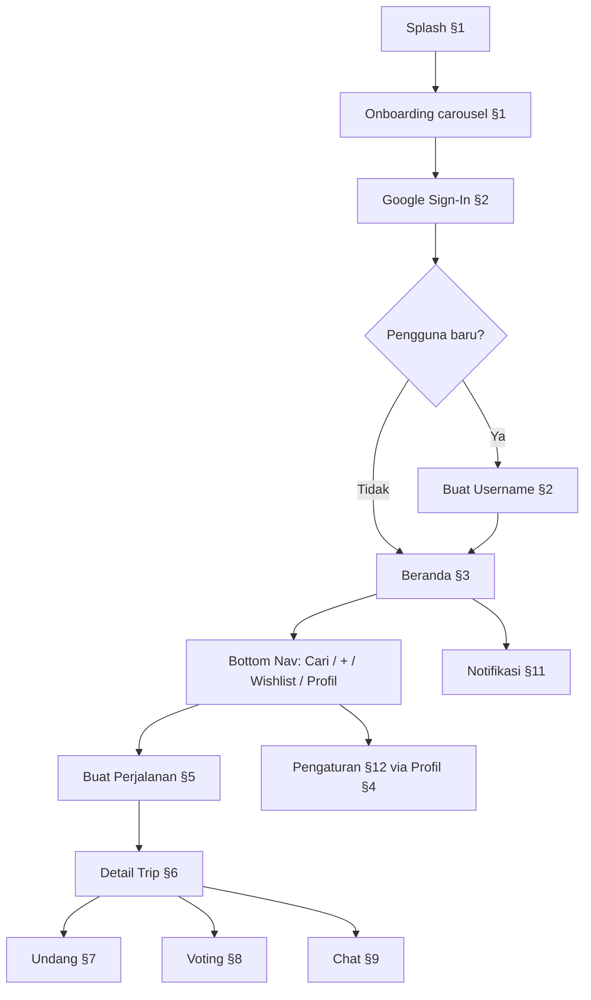

# WorkFlow - Atur Perjalanan

> **Tujuan dokumen ini**: Mendokumentasikan alur kerja pengguna (*user workflows*) dari awal membuka aplikasi hingga menggunakan seluruh fitur. Alur selaras dengan **36 layar high-fidelity** Figma (lihat `docs/FIGMA.md` untuk inventori lengkap), **5 tab Bottom Navigation Bar** utama, dan **PRD** (`docs/PRD.md`).

**Preview lokal**: `figma/src/app/App.tsx` mengelompokkan 36 layar mengikuti bagian §1–§13; **nomor layar 1–36** mengikuti urutan section yang sama.

---

## Diagram Alur Utama

---

## Peta Layar → Workflow

Setiap layar muncul **sekali** di preview bundle, dikelompokkan ke bagian workflow **utama** di bawah. Beberapa layar juga dirujuk di bagian lain (kolom *Cross-ref*).

| # | File | Bagian Utama | Cross-ref |
|---|------|--------------|-----------|
| 1 | `Screen1Splash` | §1 Onboarding | — |
| 2 | `Screen2EduOnboarding` | §1 Onboarding | — |
| 3 | `Screen3Auth` | §2 Autentikasi | — |
| 4 | `Screen4Username` | §2 Autentikasi | — |
| 5 | `Screen5Home` | §3 Beranda | — |
| 6 | `Screen6EmptyBeranda` | §3 Beranda | — |
| 33 | `Screen33HomeSelesai` | §3 Beranda | — |
| 34 | `Screen34HomeUndangan` | §3 Beranda | — |
| 35 | `Screen35SearchIdle` | §4 Pencarian & Profil | — |
| 7 | `Screen7SearchUser` | §4 Pencarian & Profil | — |
| 10 | `Screen10PublicProfile` | §4 Pencarian & Profil | — |
| 8 | `Screen8Profile` | §4 Pencarian & Profil | — |
| 36 | `Screen36ProfileEmptyTrip` | §4 Pencarian & Profil | — |
| 9 | `Screen9EditProfil` | §4 Pencarian & Profil | — |
| 11 | `Screen11Settings` | §4 Pencarian & Profil | §12 |
| 38 | `Screen38SettingsDeleteAccount` | §4 Pencarian & Profil | §12 |
| 39 | `Screen39SettingsHelpFaq` | §4 Pencarian & Profil | §12 |
| 12 | `Screen12Create` | §5 Pembuatan Perjalanan | — |
| 13 | `Screen13MultiDatePicker` | §5 Pembuatan Perjalanan | — |
| 14 | `Screen14FormValidation` | §5 Pembuatan Perjalanan | §13 |
| 15 | `Screen15Destinations` | §6 Detail Perjalanan | — |
| 16 | `Screen16Voting` | §6 Detail Perjalanan | §8 |
| 17 | `Screen17Chat` | §6 Detail Perjalanan | §9 |
| 18 | `Screen18BottomSheetDestinasi` | §6 Detail Perjalanan | — |
| 19 | `Screen19DestinationDetail` | §6 Detail Perjalanan | — |
| 20 | `Screen20BottomSheetUndang` | §7 Mengundang | — |
| 21 | `Screen21StatusLocked` | §8 Voting Tanggal | — |
| 22 | `Screen22CalendarSyncModal` | §8 Voting Tanggal | — |
| 23 | `Screen23EmptyChat` | §9 Grup Chat | — |
| 24 | `Screen24ChatLongPress` | §9 Grup Chat | — |
| 25 | `Screen25Wishlist` | §10 Wishlist | — |
| 26 | `Screen26BottomSheetWishlist` | §10 Wishlist | — |
| 27 | `Screen27Notifikasi` | §11 Notifikasi | — |
| 28 | `Screen28SkeletonLoading` | §13 System States | — |
| 29 | `Screen29ToastComponents` | §13 System States | — |
| 30 | `Screen30Error` | §13 System States | — |
| 31 | `Screen31DarkBeranda` | §13 System States | — |
| 32 | `Screen32DesignTokens` | §13 System States | — |

> **§12 Pengaturan** tidak punya layar terpisah — diakses dari Profil (`Screen8Profile`) dan direpresentasikan oleh `Screen11Settings` (bagian utama §4).

---

## Struktur Navigasi Utama (Bottom Tab Bar)

Aplikasi menggunakan *Bottom Navigation Bar* dengan 5 menu (`figma/src/app/components/BottomNav.tsx`):

| Posisi | Label | Fungsi | Workflow |
|--------|-------|--------|----------|
| 1 | **Beranda** | Daftar perjalanan (tab Mendatang / Selesai / Undangan) | §3 |
| 2 | **Cari** | Pencarian pengguna lain | §4 |
| 3 | **[+]** | FAB tengah — buat perjalanan baru | §5 |
| 4 | **Wishlist** | Daftar destinasi impian | §10 |
| 5 | **Profil** | Halaman akun pengguna | §4, §12 |

**Entry point global**: ikon lonceng di header Beranda → §11 Notifikasi.

---

## 1. Onboarding Layar Awal (Frontend)

* **Layar Figma**: `Screen1Splash`, `Screen2EduOnboarding`
* **Trigger**: Cold start aplikasi (`Screen1Splash`).
* Saat splash selesai, FE mengecek flag first-launch (DataStore lokal).
* Jika pertama kali: tampilkan carousel 4 slide (`Screen2EduOnboarding`), satu topik per layar:
  1. **Pengenalan** — "Ketahui bagaimana Atur Perjalanan membantumu"
  2. **Masalah #1 + Solusi** — Kutukan Wacana & Bentrok Jadwal → Date Voting (+ preview UI voting)
  3. **Masalah #2 + Solusi** — Inspirasi Tercecer → Pusat Informasi & Referensi (+ preview destinasi)
  4. **Masalah #3 + Solusi** — Koordinasi Tercecer → Group Chat per Perjalanan (+ preview chat)
* Setelah onboarding selesai (atau jika bukan first-launch), arahkan ke halaman Autentikasi (§2).
* **Interaksi Data**: — (flag lokal saja; tidak ada API).

## 2. Autentikasi (Google Sign-In)

* **Layar Figma**: `Screen3Auth`, `Screen4Username`
* **UI/UX**: Halaman bersih dengan logo aplikasi dan tombol "Lanjutkan dengan Google" (Warm Coral `#FF6B6B`).
* Sistem mengambil data profil dasar dari Google (Email, Nama, Avatar) dan menyimpannya ke *database*.
* **Pengguna Baru**: Diarahkan ke form pembuatan *username* unik dengan validasi real-time (`Screen4Username`).
* **Pengguna Lama**: Langsung ke Beranda (§3).
* **Interaksi Data**: Upsert tabel `users`; `POST /v1/auth/google` → `POST /v1/auth/complete-registration` (jika baru).

## 3. Beranda (Home) - Tab 1

* **Layar Figma**: `Screen5Home`, `Screen6EmptyBeranda`, `Screen33HomeSelesai`, `Screen34HomeUndangan`
* **Header**: Judul "Perjalananku" + ikon lonceng notifikasi dalam satu baris. Lonceng tanpa badge saat tidak ada notifikasi; menampilkan jumlah unread saat ada (`Screen5Home`, `Screen34HomeUndangan` = 5; `Screen33HomeSelesai` = 2; `Screen6EmptyBeranda` = 0).
* **Tab View**: "Mendatang", "Selesai", "Undangan" — masing-masing dengan **counter** jumlah item.
* **Trip Card** (`Screen5Home`): tanpa badge status — konteks tab sudah cukup.
* **Tab Selesai** (`Screen33HomeSelesai`): trip yang sudah lewat.
* **Tab Undangan** (`Screen34HomeUndangan`): card undangan dengan CTA Terima/Tolak.
* **Empty State** (`Screen6EmptyBeranda`): Ilustrasi + CTA buat perjalanan pertama.
* **Interaksi Data**: `GET /v1/trips` (filter by status/tab), `GET /v1/trips/invitations` (tab Undangan).

## 4. Pencarian & Profil - Tab 2 & Tab 5

* **Layar Figma**: `Screen35SearchIdle`, `Screen7SearchUser`, `Screen10PublicProfile`, `Screen8Profile`, `Screen36ProfileEmptyTrip`, `Screen9EditProfil`, `Screen11Settings`, `Screen39SettingsHelpFaq`, `Screen38SettingsDeleteAccount`
* **Urutan preview §4**: Cari idle → Cari hasil → Profil publik (dari hasil) → Profil pribadi → Edit profil → Pengaturan.

### Pencarian (Tab Cari)
* **Idle** (`Screen35SearchIdle`): search bar kosong + riwayat pencarian terakhir.
* **Hasil** (`Screen7SearchUser`): search bar aktif + list hasil — Avatar, Username, Nama, tombol Follow/Unfollow.
* Akun privat tetap muncul di hasil; viewer belum bisa lihat grid trip sampai follow.
* **Interaksi Data**: `GET /v1/users/search`, `POST/DELETE /v1/users/:username/follow`.

### Profil Pribadi (Tab Profil)
* Username di **header** (bukan di kartu profil), ala Instagram.
* Layout: kartu profil horizontal, statistik ringkas, grid trip lengkap, tombol Edit Profil & ikon Pengaturan.
* **Empty trip** (`Screen36ProfileEmptyTrip`): profil tanpa perjalanan di grid.
* Owner selalu melihat semua trip yang ia buat di grid (termasuk `trips.is_public=false`).
* **Interaksi Data**: `GET /v1/users/me`, `GET /v1/users/me/trips` (semua trip creator).

### Profil User Lain (`Screen10PublicProfile`)
* Dibuka saat tap hasil pencarian. Username di header kiri (dengan tombol back).
* **Akun publik**: profil lengkap + grid trip (`trips.is_public=true` milik creator).
* **Akun privat** (Instagram-style): non-follower hanya melihat avatar, username, nama, stats, tombol Follow, dan banner *"Akun ini privat"* — **tanpa bio dan tanpa grid trip**.
* **Follower akun privat**: profil lengkap + grid trip (`trips.is_public=true`).
* **Interaksi Data**: `GET /v1/users/:username` (field `can_view_content`), `GET /v1/users/:username/trips` (403 jika privat & bukan follower).

### Edit Profil (`Screen9EditProfil`)
* Edit bio + toggle akun privat/publik (`is_public`).
* **Interaksi Data**: `PUT /v1/users/me`.

## 5. Pembuatan Perjalanan - Tab [+]

* **Layar Figma**: `Screen12Create`, `Screen13MultiDatePicker`, `Screen14FormValidation`
* **UI/UX**: Modal full-screen (`Screen12Create`) dengan form:
  * Input "Nama Perjalanan" (wajib — validasi error di `Screen14FormValidation`)
  * Tags dinamis (ketik → chip teal, tombol × hapus)
  * Kalender rentang tanggal (start–end) dengan navigasi bulan
  * Tombol "+ Tambah Kandidat Tanggal" (dashed border) → menambah card kalender baru (`Screen13MultiDatePicker`)
  * CTA sticky "Buat Perjalanan" (Warm Coral)
* **Interaksi Data**:
  * 1 rentang tanggal → `status=fixed`, simpan `start_date`/`end_date` di `trips`
  * >1 rentang → `status=voting_pending`, simpan ke `trip_date_candidates`
  * `POST /v1/trips`

## 6. Detail Perjalanan — Tab Destinasi · Voting · Chat

* **Layar Figma**: `Screen15Destinations`, `Screen16Voting`, `Screen17Chat`, `Screen18BottomSheetDestinasi`, `Screen19DestinationDetail`
* **Entry**: Tap trip card di Beranda (§3) atau deep link dari Notifikasi (§11).
* Header: judul trip, tanggal/anggota, tombol back, menu `⋯`, tombol "+ Undang Teman".
* **3 Tab** (bukan "Info"): **Destinasi · Voting · Chat**

### Tab Destinasi
* Vertical list destinasi dengan emoji/ikon, nama, lokasi.
* Empty state + tombol "Tambah Destinasi".
* Bottom sheet form (`Screen18BottomSheetDestinasi`): Nama Tempat (wajib), Link Google Maps, Link Referensi TikTok/IG.
* Tap card → **Detail Destinasi sheet** (`Screen19DestinationDetail`): snippet peta, tombol Buka Maps, link referensi media sosial.
* **Interaksi Data**: `GET/POST/DELETE /v1/trips/:id/destinations`

### Tab Voting
* Lihat §8. Saat `status=fixed`, tampilkan state terkunci (`Screen21StatusLocked`) — bukan kandidat voting.

### Tab Chat
* Lihat §9.

## 7. Mengundang Partisipan & Kolaborasi

* **Layar Figma**: `Screen20BottomSheetUndang`
* **Entry**: Tombol "+ Undang Teman" di header detail trip (§6).
* Bottom sheet: cari username atau input email.
* **Interaksi Data**:
  * Via Username → `trip_invitations` (status pending); notifikasi in-app (§11)
  * Via Email → Google Calendar API event invite (M11)
  * Terima undangan → mutual follow otomatis + `trip_participants`

## 8. Voting Tanggal

* **Layar Figma**: `Screen16Voting` (tab di §6), `Screen21StatusLocked`, `Screen22CalendarSyncModal`
* Berlaku untuk `status=voting_pending`.
* Tab Voting menampilkan card kandidat tanggal + jumlah vote + tombol Vote.
* Creator: tombol "Kunci Tanggal Ini" pada kandidat terpilih.
* Setelah lock (`status=fixed`): banner teal "Jadwal Dikunci" (`Screen21StatusLocked`) + modal sukses sync kalender (`Screen22CalendarSyncModal`).
* **Interaksi Data**: `trip_date_votes`, lock → update `trips`, trigger Google Calendar sync.

## 9. Grup Chat Internal Perjalanan

* **Layar Figma**: `Screen17Chat` (tab di §6), `Screen23EmptyChat`, `Screen24ChatLongPress`
* Chat bubbles (coral = pesan sendiri, putih = pesan orang lain), input + kirim + lampiran (UI).
* Header chat: nama grup, jumlah anggota aktif, mini avatars.
* **Empty State** (`Screen23EmptyChat`): ilustrasi + prompt mulai obrolan.
* **Long Press** (`Screen24ChatLongPress`): menu konteks → Balas, Salin Teks, Hapus (pesan sendiri).
* **Interaksi Data**: `GET/POST /v1/trips/:id/messages` (cursor-paginated, chronological).

## 10. Wishlist - Tab 4

* **Layar Figma**: `Screen25Wishlist`, `Screen26BottomSheetWishlist`
* Grid/List view + Filter/Sort bar (tags, prioritas).
* FAB "+" → bottom sheet form: Nama Tempat, Link, Tags, Prioritas (Tinggi/Menengah/Rendah).
* **Interaksi Data**: `GET/POST/PUT/DELETE /v1/wishlists`

## 11. Notifikasi

* **Layar Figma**: `Screen27Notifikasi`
* Diakses via ikon lonceng di Beranda (§3).
* Tipe notifikasi:
  * **Undangan trip** — aksi Terima / Tolak
  * **Follow baru** — aksi Follow back
  * **Voting deadline** — aksi Vote (deep link ke tab Voting di §6/§8)
  * **Update destinasi** — tap navigasi ke trip detail (§6)
* Badge unread di ikon lonceng; mark-as-read saat dibuka.
* **Interaksi Data**: `GET /v1/notifications`, `PUT /v1/notifications/:id/read` (target M8+). Sementara bisa di-*compose* dari `trip_invitations` + polling/events.

## 12. Pengaturan

* **Layar Figma**: `Screen11Settings`, `Screen39SettingsHelpFaq`, `Screen38SettingsDeleteAccount`
* **Entry**: Ikon Pengaturan dari Profil pribadi (§4).

### Kepatuhan Google Play Store (2025–2026)

| Item menu | Wajib Play? | Catatan |
|-----------|-------------|---------|
| **Kebijakan Privasi** | **Ya** | Harus ada di app dengan label jelas + link di Play Console & Data safety form |
| **Hapus Akun** | **Ya** | Wajib jika user bisa buat akun; butuh jalur in-app + URL web di Play Console |
| **Syarat & Ketentuan** | Tidak wajib | Best practice; sering digabung dengan privasi |
| **Notifikasi** | Tidak wajib | *Ditunda* — belum ada toggle off push |
| **Privasi & Keamanan** | Tidak wajib label ini | *Phase berikutnya* — toggle `is_public` |
| **Bantuan & FAQ** | Tidak wajib | Membantu dukungan pengguna |
| **Tentang Aplikasi** | Tidak wajib | Versi ditampilkan sebagai teks footer di `Screen11Settings` |
| **Keluar** | Tidak wajib | Diharapkan untuk app ber-autentikasi |

> **Di luar app (wajib di Play Console)**: Data safety form, URL kebijakan privasi, URL penghapusan akun web.

### Sub-layar yang disarankan (belum semua ada di Figma)

| Menu | Layar berikutnya | Isi utama |
|------|------------------|-----------|
| Notifikasi | — | *Ditunda MVP* | — |
| Privasi & Keamanan | — | *Phase berikutnya* | Toggle `is_public` |
| Hapus Akun | `Screen38SettingsDeleteAccount` | Peringatan ringkas, konfirmasi username | `DELETE /v1/users/me` |
| Bantuan & FAQ | `Screen39SettingsHelpFaq` | Accordion FAQ + email kontak | — |
| Kebijakan Privasi | WebView / in-app browser | URL `https://…/privacy` — konten legal |
| Syarat & Ketentuan | WebView | URL `https://…/terms` |
| Tentang Aplikasi | Footer `Screen11Settings` | Teks versi saja | — |
| Keluar | Dialog konfirmasi | "Yakin keluar?" → hapus token lokal → §2 Auth |

* Grup menu (`Screen11Settings`):
  * **Bantuan & Legal**: Bantuan & FAQ, Kebijakan Privasi, Syarat & Ketentuan
  * **Akun**: Hapus Akun
  * **Keluar**: Hapus token lokal + redirect ke Sign In (§2)
  * **Footer**: `Atur Perjalanan · v2.4.1` (bukan menu item)
* **Interaksi Data**: `DELETE /v1/users/me` (hapus akun); push prefs endpoint terpisah (post-MVP).

## 13. System States & Micro-interactions

* **Layar Figma**: `Screen28SkeletonLoading`, `Screen29ToastComponents`, `Screen30Error`, `Screen31DarkBeranda`, `Screen32DesignTokens`
* Pola system UX berikut dikelompokkan di bagian fitur utama: `Screen1Splash` (§1), `Screen14FormValidation` (§5).

| State | Layar | Deskripsi | Trigger |
|-------|-------|-----------|---------|
| **Splash** | 1 | Logo coral + loading | App cold start (§1) |
| **Skeleton** | 28 | Shimmer placeholder card/list | Fetch data in-progress |
| **Toast Success** | 29 | Teal snackbar (contoh: "Perjalanan berhasil dibuat") | Aksi sukses |
| **Toast Error** | 29 | Coral snackbar + tombol Retry | API error |
| **Toast Offline** | 29 | Info banner "Tidak ada koneksi" | Network unreachable |
| **Error 404/Offline** | 30 | Ilustrasi compass + CTA "Coba Lagi" | Halaman/route tidak ditemukan atau offline |
| **Form Validation** | 14 | Border merah `#E53935` + pesan error inline | Submit form invalid (§5) |
| **Dark Mode** | 31 | Variant Beranda dengan palette gelap | System theme / user preference (M12) |

Design tokens lengkap: `Screen32DesignTokens.tsx` / `figma/src/app/components/colors.ts`.

---

## Relasi dengan Dokumen Lain

| Dokumen | Peran |
|---------|-------|
| `docs/BRIEF.md` | Masalah, solusi, audiens, brand philosophy (Sunset & Beach) |
| `docs/PRD.md` | Spesifikasi MVP per fitur — selaras dengan bagian §1–§13 di sini |
| `docs/FIGMA.md` | Inventori layar, design tokens, gap API vs backend |
