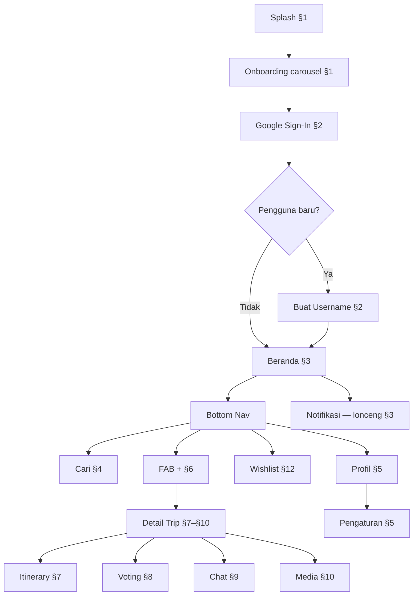

# WorkFlow - Atur Perjalanan

> **Tujuan dokumen ini**: Mendokumentasikan alur kerja pengguna (*user workflows*) dari awal membuka aplikasi hingga menggunakan seluruh fitur. Alur selaras dengan **125 layar high-fidelity** Figma (lihat `docs/FIGMA.md`), **5 tab Bottom Navigation Bar**, **PRD**, dan **kontrak API backend** (`docs/ARCHITECTURE.md §4.3`).

**Preview lokal**: `figma/src/app/App.tsx` — **125 layar**, **§1–§13**. Nomor layar = indeks `Screen{N}` (sequential 1–125). Setiap layar **sekali** di registry.

**Legenda API** (di kolom Interaksi Data):

| Simbol | Arti |
|--------|------|
| ✅ | Endpoint + schema **sudah ada** di backend (M0–M5.1) |
| 🔜 | **Target M5.2** — wajib sebelum mobile parity penuh |
| — | Client-only (tanpa API) |
| M11 | Google Calendar — milestone terpisah |

Spesifikasi teknis lengkap: `docs/ARCHITECTURE.md §3.0.1` (matrix schema/API) · `§4.3.0` (35 endpoint implemented) · `§4.3.2` (gap M5.2).

---

## Diagram Alur Utama

---

## Peta Preview §1–§13

| § | Judul (App.tsx) | Tab / Entry | Layar (contoh) |
|---|-----------------|-------------|----------------|
| 1 | Onboarding | Cold start | 1–2 |
| 2 | Autentikasi | Post-onboarding | 3–4 |
| 3 | Beranda | Tab 1 + lonceng | 5–9 |
| 4 | Pencarian | Tab 2 | 10–14 |
| 5 | Profil | Tab 5 + Pengaturan | 15–20 |
| 6 | Pembuatan Perjalanan | FAB [+] | 21–41 |
| 7 | Detail — Itinerary | Tab trip | 42–55 |
| 8 | Detail — Voting | Tab trip | 56–75 |
| 9 | Detail — Chat | Tab trip | 76–92 |
| 10 | Detail — Media | Tab trip | 93–94 |
| 11 | Detail — Kelola Trip | Menu ⋮ | 95–103 |
| 12 | Wishlist | Tab 4 | 104–117 |
| 13 | System States | Global patterns | 118–125 |

---

## Struktur Navigasi Utama (Bottom Tab Bar)

Aplikasi menggunakan *Bottom Navigation Bar* dengan 5 menu (`figma/src/app/components/BottomNav.tsx`):

| Posisi | Label | Fungsi | Workflow |
|--------|-------|--------|----------|
| 1 | **Beranda** | Daftar perjalanan (tab Mendatang / Selesai / Undangan) | §3 |
| 2 | **Cari** | Pencarian pengguna lain | §4 |
| 3 | **[+]** | FAB tengah — buat perjalanan baru | §6 |
| 4 | **Wishlist** | Wishlist aktivitas impian | §12 |
| 5 | **Profil** | Halaman akun pengguna + pengaturan | §5 |

**Entry point global**: ikon lonceng di header Beranda → `Screen9Notifikasi` (digroup di §3 preview).

---

## §1. Onboarding Layar Awal

* **Layar Figma**: `Screen1Splash`, `Screen2EduOnboarding`
* **Trigger**: Cold start aplikasi (`Screen1Splash`).
* Saat splash selesai, FE mengecek flag first-launch (DataStore lokal).
* Jika pertama kali: carousel 4 slide (`Screen2EduOnboarding`):
  1. **Intro** — *"Realisasikan Wacana Liburanmu"*
  2. **Masalah + Solusi (Voting)** — Sepakat Jadwal Susah Banget → Vote Bareng, Hasil Jelas (+ preview mini voting)
  3. **Masalah + Solusi (Itinerary)** — Rencana Berserakan, Urutan Nggak Jelas → Timeline Harian yang Jelas (+ preview mini itinerary multi-hari)
  4. **Masalah + Solusi (Chat)** — Chat Trip Kecampur → Ruang Diskusi Khusus Trip (+ preview mini chat)
* Layout: scroll penuh konten + indicator slide sticky di atas CTA; tombol Selanjutnya/Mulai fixed bawah.
* Setelah onboarding selesai (atau jika bukan first-launch), arahkan ke Autentikasi (§2).
* **Interaksi Data**: — (flag first-launch di DataStore lokal; **tanpa API**)

## §2. Autentikasi (Google Sign-In)

* **Layar Figma**: `Screen3Auth`, `Screen4Username`
* **UI/UX**: Halaman bersih dengan logo aplikasi dan tombol "Lanjutkan dengan Google" (Warm Coral `#FF6B6B`).
* Sistem mengambil data profil dasar dari Google (Email, Nama, Avatar) dan upsert ke `users`.
* **Pengguna Baru**: Form *username* unik + validasi real-time (`Screen4Username`).
* **Pengguna Lama**: Langsung ke Beranda (§3).

| Aksi | Method | Endpoint | Status |
|------|--------|----------|--------|
| Login Google | POST | `/v1/auth/google` `{id_token}` → JWT + `is_new_user` | ✅ |
| Set username | POST | `/v1/auth/complete-registration` `{username}` | ✅ |
| Cek username | GET | `/v1/users/check-username?username=` → `{available}` | ✅ |

## §3. Beranda (Home) — Tab 1

* **Layar Figma**: `Screen5Home`, `Screen6EmptyBeranda`, `Screen7HomeSelesai`, `Screen8HomeUndangan`, `Screen9Notifikasi`
* **Header**: Judul "Perjalananku" + lonceng notifikasi (badge unread).
* **Tab View**: "Mendatang", "Selesai", "Undangan" — masing-masing dengan **counter**.
* **Trip Card** (`Screen5Home`): `cover_image_url`, judul, tags, rentang tanggal, stacked avatars (`participants_preview`).
* **Tab Undangan** (`Screen8HomeUndangan`): card enriched (trip + inviter) + Terima/Tolak.
* **Notifikasi** (`Screen9Notifikasi`): tipe `invite`, `voting_deadline`, `destination_update`.

| Aksi | Method | Endpoint | Status |
|------|--------|----------|--------|
| List trip mendatang | GET | `/v1/trips?tab=upcoming&cursor=` | ✅ |
| List trip selesai | GET | `/v1/trips?tab=completed&cursor=` | ✅ |
| Undangan pending | GET | `/v1/trips/invitations` | ✅ |
| Terima/Tolak undangan | PUT | `/v1/trips/:tripId/invitations/:id` `{accept}` | ✅ |
| List notifikasi | GET | `/v1/notifications/?cursor=` | ✅ |
| Badge unread | GET | `/v1/notifications/unread-count` | ✅ |
| Mark read | PUT | `/v1/notifications/:id/read` atau `/read-all` | ✅ |

> Response trip enriched: `participant_count`, `participants_preview[]`, `cover_image_url`, `voting_deadline`.

## §4. Pencarian (Cari) — Tab 2

* **Layar Figma**: `Screen10SearchIdle`, `Screen11SearchUser`, `Screen12SearchNoResults`, `Screen13PublicProfile`, `Screen14PublicProfileEmptyTrip`
* **Urutan preview**: Cari idle → Cari hasil → Cari kosong → Profil publik (dari hasil) → Profil publik empty trip.

### Flow Pencarian
* **Idle** (`Screen10SearchIdle`): search bar + riwayat terakhir (**client-only**).
* **Hasil** (`Screen11SearchUser`): Avatar, Username, Nama → tap → profil.
* **Kosong** (`Screen12SearchNoResults`): tidak ada hasil.

| Aksi | Method | Endpoint | Status |
|------|--------|----------|--------|
| Cari user | GET | `/v1/users/search?q=&limit=&cursor=` | ✅ |

### Profil User Lain (dari hasil cari)
* **`Screen13PublicProfile`**: profil horizontal + bar stat + grid trip publik (`trips.is_public=true`).
* **`Screen14PublicProfileEmptyTrip`**: profil tanpa trip di grid.

| Aksi | Method | Endpoint | Status |
|------|--------|----------|--------|
| Profil | GET | `/v1/users/:username` → `ProfileView` + `public_trip_count` | ✅ |
| Grid trip | GET | `/v1/users/:username/trips` (stranger: hanya `is_public`) | ✅ |

## §5. Profil — Tab 5

* **Layar Figma**: `Screen15Profile`, `Screen16ProfileEmptyTrip`, `Screen17Settings`, `Screen18EditProfil`, `Screen19SettingsHelpFaq`, `Screen20SettingsDeleteAccount`

### Profil Pribadi
* Username di **header** (bukan di kartu profil); ikon **Pengaturan** di kanan header (simetris).
* Kartu profil **horizontal** — avatar kiri, nama + bio + link website kanan; bar stat perjalanan compact di bawah (referensi desain awal, lebih hemat ruang).
* Jumlah perjalanan di **bar stat** dalam kartu (angka 18px bold + label), bukan section terpisah.
* Grid **semua** trip creator (termasuk `is_public=false`).
* **Empty trip** (`Screen16ProfileEmptyTrip`).

| Aksi | Method | Endpoint | Status |
|------|--------|----------|--------|
| Profil saya | GET | `/v1/users/me` | ✅ |
| Grid trip saya | GET | `/v1/users/{my_username}/trips` | ✅ |

### Edit Profil (`Screen18EditProfil`)
* Akses dari **Pengaturan** → tap kartu profil teratas (`Screen17Settings`, ringkasan nama + @username + bio).
* Edit bio; UI juga menampilkan website/sosial & ubah foto — **partial BE support**.

| Aksi | Method | Endpoint | Status |
|------|--------|----------|--------|
| Update bio | PUT | `/v1/users/me` `{bio}` | ✅ |
| Website / lokasi pin | PUT | `/v1/users/me` `{website_url?, location_label?}` | 🔜 M5.2 |
| Upload avatar | POST | `/v1/users/me/avatar` (multipart) | 🔜 M5.2 |

### Pengaturan (akses dari ikon ⚙ di header Profil)
* **`Screen17Settings`**: kartu profil teratas (→ Edit Profil), section **Bantuan** (FAQ, privasi, S&K), **Akun** (keluar, hapus akun).
* **`Screen19SettingsHelpFaq`**: FAQ + kontak.
* **`Screen20SettingsDeleteAccount`**: konfirmasi hapus akun.

| Aksi | Method | Endpoint | Status |
|------|--------|----------|--------|
| Hapus akun | DELETE | `/v1/users/me` | 🔜 M5.2 |
| Logout | — | Clear JWT lokal (opsional `POST /auth/logout`) | — |

## §6. Pembuatan Perjalanan — Tab [+]

* **Layar Figma**: `Screen21CreateTripEmpty`, `Screen22Create`, `Screen23CreateTripFixedDate`, `Screen24CreateTripFixedValidation`, `Screen25`–`Screen26`, `Screen27`–`Screen32`, `Screen33FormValidation`, `Screen34CreateTripSubmitting`, `Screen35BottomSheetUndang`, `Screen36`–`Screen41`
* **UI/UX**: Modal full-screen — form **ringkas**:
  * Input "Nama Perjalanan" (wajib)
  * Tags dinamis (opsional)
  * Kalender rentang tanggal (wajib) + "+ Tambah Kandidat Tanggal"
  * **Waktu** (opsional): toggle *Sepanjang hari* (default) — jika off, set jam mulai & selesai
  * CTA sticky "Buat Perjalanan"
* **Mode A (tanggal pasti)**: 1 rentang → `status=fixed`.
* **Mode B (kandidat)**: >1 kandidat → `status=voting_pending` + auto voting tanggal + tenggat.
* **Undang setelah buat** — **hanya via pencarian** (tidak ada daftar saran teman):
  * `Screen35` — search kosong + CTA "Masuk ke Perjalanan"
  * `Screen36` — hasil pencarian ditemukan
  * `Screen37` — hasil cari, sebagian sudah terundang
  * `Screen38` — tidak ditemukan
  * `Screen39` — email belum terdaftar
  * `Screen40` — email terkirim (langsung, tanpa layar konfirmasi terpisah)
  * `Screen41` — daftar yang sudah diundang (bisa batalkan)
* **Validasi** (`Screen33FormValidation`): semua error wajib **sekaligus**.

| Aksi | Method | Endpoint | Status |
|------|--------|----------|--------|
| Buat trip (fixed) | POST | `/v1/trips/` `{name, tags, start_date, end_date}` | ✅ |
| Buat trip (voting) | POST | `/v1/trips/` `{name, tags, candidates[2-3]}` → `voting_pending` | ✅ |
| Waktu non-all-day | POST | `/v1/trips/` + `is_all_day, start_time, end_time` | 🔜 M5.2 |
| Undang username | POST | `/v1/trips/:id/invitations` `{username}` | ✅ |
| Undang email | POST | `/v1/trips/:id/invitations` `{email}` | ✅ |
| Cari untuk undang | GET | `/v1/users/search?q=` | ✅ |
| Batalkan undangan | DELETE | `/v1/trips/:id/invitations/:id` | 🔜 M5.2 |

> Setelah create: creator auto-masuk `trip_participants`. `voting_deadline` auto-set jika >1 kandidat.

## §7. Detail Perjalanan — Tab Itinerary

Entry detail trip: tap card Beranda (§3), setelah buat (§6), konversi wishlist (§12), atau deep link notifikasi.

* **Header global** (`TripDetailHeader`): judul trip, tanggal/waktu/status, back, menu **⋮** (§11).
* **4 Tab** (`TripDetailTabs`): Itinerary · Voting · Chat · Media — dengan counter (Voting tab hidden jika 0 aktif; Chat badge = unread; Media counter always visible).

* **Layar Figma**: `Screen42ItineraryEmpty`, `Screen43Destinations`, `Screen44DestinationsFixedDate`, `Screen45BottomSheetDestinasi`, `Screen85`–`Screen93`
* Timeline multi-hari dengan aktivitas berjadwal (waktu mulai/selesai, window harian).
* State waktu: past / present (Sekarang) / future — `resolveItineraryTimeState`.
* Bottom sheet tambah aktivitas — form selaras `ActivityFormSheet`.
* Cover aktivitas: Maps thumbnail, icon transport, atau media trip.
* Menu ⋮ per item: Edit · Hapus.
* **Naming**: UI = **Itinerary/aktivitas**; BE = `trip_destinations` / `/destinations`.

| Aksi | Method | Endpoint | Status |
|------|--------|----------|--------|
| List aktivitas | GET | `/v1/trips/:id/destinations` | ✅ (field minimal) |
| Tambah aktivitas | POST | `/v1/trips/:id/destinations` | ✅ (field minimal) |
| Hapus aktivitas | DELETE | `/v1/trips/:id/destinations/:id` | ✅ |
| Edit aktivitas | PUT | `/v1/trips/:id/destinations/:id` | 🔜 M5.2 |
| Enriched fields | — | times, kind, ref_links[], cover_*, thumbnail | 🔜 M5.2 schema |
| Resolve Maps thumb | — | Places/Static API di BE | 🔜 M5.2 |

> Field minimal today: `place_name`, `maps_link`, `reference_link`, `sort_order`. Target penuh selaras `ActivityDraft` (`ActivityParts.tsx`).

## §8. Detail Perjalanan — Tab Voting

* **Layar Figma**: `Screen56Voting`, `Screen57VotingEmpty`, `Screen58`–`Screen75`
* **Multi-voting** concurrent — Tanggal / **Aktivitas** (internal type `destinasi`) / Lainnya — collapse section.
* **Empty** (`Screen57VotingEmpty`): trip tanggal pasti, badge voting **0**, CTA buat voting baru.
* Pipeline: aktif → selesai (manual/auto berakhir) → menu hanya Hapus.
* Buat voting baru: max 1 Tanggal & 1 Aktivitas aktif per trip.
* Reminder voting: cron H-7d / H-1d / H-1h (`voting_deadline`).

### Sheet buat / edit voting (`CreateVotingSheetParts.tsx`)

| Sheet | Layar | Title | Catatan |
|-------|-------|-------|---------|
| Pilih jenis | `Screen64`, `Screen58` | Buat Voting | Tinggi **fit content**; badge **Sedang berlangsung** hanya di `Screen64` (tanggal disabled saat voting tanggal aktif) — **tidak** di `Screen58` (buat ulang setelah selesai) |
| Detail Voting | `Screen65` (aktivitas), `Screen59`/`Screen61`/`Screen63` (tanggal) | **Detail Voting** | Jenis via badge inline — bukan di judul sheet |
| Tambah Kandidat Tanggal | `Screen60`, `Screen62` | **Tambah Kandidat Tanggal** | Subtitle statis; picker kalender |
| Edit Voting | `Screen66` (aktivitas), `Screen67` (tanggal) | **Edit Voting** | Tanggal: **tanpa** tombol kembali; footer **Simpan** |

**Copy subtitle (statis)**:
* Aktivitas/Lainnya — Detail: *"Isi judul dan kandidat yang akan divoting anggota."* · Edit: *"Ubah judul, kandidat, atau tenggat voting ini."*
* Tanggal — Detail: *"Tambahkan kandidat tanggal perjalanan yang akan divoting anggota."* · Edit: *"Ubah kandidat tanggal atau tenggat voting ini."* · Tambah kandidat: *"Pilih rentang tanggal di kalender, lalu simpan sebagai kandidat."*

**Form tanggal** (`CreateVotingTanggalDetailsForm`): **tanpa** field Judul voting — hanya kandidat tanggal + tenggat (opsional, muncul jika ≥1 kandidat). Judul voting tanggal di card pipeline tetap label tetap **Tanggal Perjalanan**.

**Form aktivitas/lainnya** (`CreateVotingDetailsForm`): Judul voting + kandidat + tenggat.

| Aksi | Method | Endpoint | Status |
|------|--------|----------|--------|
| List kandidat tanggal | GET | `/v1/trips/:id/candidates` enriched | ✅ |
| Vote / unvote tanggal | POST/DELETE | `…/candidates/:id/vote` | ✅ |
| Kunci tanggal (creator) | POST | `…/candidates/:id/lock` → `status=fixed` | ✅ |
| Poll Aktivitas/Lainnya | CRUD + vote + lock/end | `/v1/trips/:id/polls` | 🔜 M5.2c |
| Buat voting baru (sheet) | POST | `/v1/trips/:id/polls` `{poll_type, title, options[], deadline?}` | 🔜 M5.2c |

> Tanggal voting = legacy `trip_date_candidates`. Multi-poll hub (Tanggal + **Aktivitas** + Lainnya) butuh `trip_polls` (§3.5 ARCHITECTURE).

## §9. Detail Perjalanan — Tab Chat

* **Layar Figma**: `Screen76Chat`, `Screen86EmptyChat`, `Screen87ChatLongPress`, `Screen88ChatLongPressOwn`, `Screen89`–`Screen92` (balas pesan), `Screen77`–`Screen85`
* Chat bubbles (coral = pesan sendiri), input + kirim + lampiran foto/video.
* **Empty State** (`Screen86EmptyChat`): ilustrasi + prompt mulai obrolan.
* **Long Press** (`Screen87` pesan orang lain · `Screen88` pesan sendiri): Balas, Salin Teks; **Hapus** hanya pada pesan sendiri.
* **Balas pesan** (`Screen89`–`Screen92`): quote pesan asal di dalam bubble (`ChatReplyQuote`) — saya→orang lain, saya→saya, orang lain→orang lain, orang lain→saya (label quote **Kamu** untuk pesan sendiri).

| Aksi | Method | Endpoint | Status |
|------|--------|----------|--------|
| Load chat | GET | `/v1/trips/:id/messages?cursor=` (RFC3339) | ✅ |
| Kirim teks | POST | `/v1/trips/:id/messages` `{message}` | ✅ |
| Hapus pesan sendiri | DELETE | `/v1/trips/:id/messages/:messageId` soft | ✅ |
| Kirim foto/video | POST | multipart `{kind, file, caption?}` | 🔜 M5.2e |
| Balas pesan | POST | `{reply_to_id}` | 🔜 M5.2e |
| Mark read (badge) | PUT | `/v1/trips/:id/messages/read` | 🔜 M5.2d |
| Salin teks | — | Clipboard client | — |

> Media chat otomatis masuk tab Media (§10) via `trip_documents.from_chat=true`.

## §10. Detail Perjalanan — Tab Media

* **Layar Figma**: `Screen93TripDocuments`, `Screen94MediaFromChat`
* Grid foto/video perjalanan; unggah dari perangkat.
* **Cover trip** dipilih via "Jadikan Cover" — card Beranda resolve dari media ini.
* Media dari chat otomatis masuk tab Media (`Screen98`).

| Aksi | Method | Endpoint | Status |
|------|--------|----------|--------|
| List media | GET | `/v1/trips/:id/documents` | 🔜 M5.2b |
| Upload foto/video | POST | `/v1/trips/:id/documents` multipart | 🔜 M5.2b |
| Hapus media | DELETE | `/v1/trips/:id/documents/:id` | 🔜 M5.2b |
| Jadikan cover | PUT | `/v1/trips/:id/cover` `{document_id}` | 🔜 M5.2b |

> Counter tab Media **selalu tampil** (termasuk 0). Cover card Beranda resolve dari `cover_document_id` atau default asset.

## §11. Detail Perjalanan — Kelola Trip (menu ⋮)

* **Layar Figma**: `Screen97TripMembers`, `Screen98`–`Screen102`, `Screen96CalendarSyncModal`, `Screen103TripEdit`, `Screen95TripDelete`
* **Daftar Anggota** — semua anggota bisa undang / batalkan / undang kembali **calon anggota** (pending); hanya **pembuat** yang bisa keluarkan anggota yang sudah bergabung (`Screen102` = POV anggota).
* **Section Pending** — undangan belum selesai: (1) belum daftar app (`email_sent`), (2) sudah punya akun belum terima (`pending_accept`). Semua anggota bisa **Batalkan**. Undangan **ditolak** (`rejected`) dengan opsi **Undang kembali**.
* **Tambah ke Google Calendar** — modal (`Screen96CalendarSyncModal`, M11).
* **Edit Info Perjalanan** — modal (`Screen103TripEdit`).
* **Hapus Perjalanan** — konfirmasi (`Screen95TripDelete`).

| Aksi | Method | Endpoint | Status |
|------|--------|----------|--------|
| List anggota + pending | GET | `/v1/trips/:id/members` | 🔜 M5.2 |
| Undang (search) | POST | `/v1/trips/:id/invitations` | ✅ |
| Batalkan undangan | DELETE | `/v1/trips/:id/invitations/:id` | 🔜 M5.2 |
| Keluarkan anggota | DELETE | `/v1/trips/:id/members/:userId` | 🔜 M5.2 |
| Edit info trip | PUT | `/v1/trips/:id` `{name, tags, dates?}` | ✅ |
| Hapus trip | DELETE | `/v1/trips/:id` soft (creator) | ✅ |
| Google Calendar | POST | `/v1/integrations/google-calendar/events` | M11 |

## §12. Wishlist Aktivitas — Tab 4

* **Layar Figma**: `Screen104WishlistEmpty`, `Screen105Wishlist`, `Screen110WishlistFilterEmpty`, `Screen111AddWishlistEmpty`, `Screen108BottomSheetWishlist`, `Screen112AddWishlistValidation`, `Screen113WishlistDetail`, `Screen114EditWishlist`, `Screen115WishlistCardMenu`, `Screen116WishlistDelete`, `Screen117WishlistToTripEmpty`, `Screen118WishlistToTripReady`, `Screen119WishlistToTripInvite`, `Screen120ItineraryFromWishlist`
* **Shared components**: `figma/src/app/components/trip/WishlistParts.tsx`

### Daftar & Filter
* Header **Wishlist Aktivitas** — **grid-only**.
* Sort tab prioritas: Semua / Tinggi / Menengah / Rendah (dengan counter).
* Filter tag + search bar.

### Tambah / Edit / Detail / Konversi
* Form field order: Mulai/Selesai → Nama → Prioritas → Maps → Link · CTA **Simpan Aktivitas**.
* Tap card → detail + CTA **Jadikan Perjalanan** (`Screen110`).
* **Jadikan Perjalanan**: `Screen114` prefill → `Screen115` submit → `Screen116` undang + banner hapus wishlist → `Screen120` 1 aktivitas itinerary hari 1.

| Aksi | Method | Endpoint | Status |
|------|--------|----------|--------|
| List + filter | GET | `/v1/wishlists/?priority=&tag[]=&cursor=` | ✅ |
| Tambah / edit | POST/PUT | `/v1/wishlists/` `{place_name, link, tags, priority_level}` | ✅ (field minimal) |
| Hapus | DELETE | `/v1/wishlists/:id` soft | ✅ |
| Enriched fields | — | start/end time, location, notes, thumbnail | 🔜 M5.2 |
| Jadikan Perjalanan | POST | `/v1/wishlists/:id/convert-to-trip` `{trip_name?, tags?, invite?}` | 🔜 M5.2 |

> Konversi **harus atomic** (transaction): create trip + 1 aktivitas hari 1 + soft-delete wishlist (`§3.4 ARCHITECTURE`).

## §13. System States & Micro-interactions

* **Layar Figma (unik di registry)**: `Screen118SkeletonLoading`, `Screen119ToastComponents`, `Screen120Error`, `Screen124DarkBeranda`, `Screen125DesignTokens`, `Screen121MediaViewerPhoto`, `Screen122MediaViewerVideo`, `Screen123MediaViewerVideoPlaying`
* Pola UX lain (empty, validasi, modal konfirmasi, loading submit) **hanya** muncul di section fitur masing-masing — tidak diduplikasi di §13 preview.
* Design tokens: `figma/src/app/components/colors.ts`, `Screen125DesignTokens.tsx`.

| State | Layar | Deskripsi |
|-------|-------|-----------|
| Splash | 1 | Logo coral + loading (§1) |
| Skeleton | 118 | Shimmer placeholder |
| Toast | 119 | Success (teal) / error (coral) / offline |
| Error | 120 | Offline / 404 + retry |
| Dark Mode | 124 | Variant Beranda gelap (M12) |
| Media Viewer | 121–123 | Foto / video pause / playing |
| Form Validation | 33 | Inline errors (§6) |

---

## Relasi dengan Dokumen Lain

| Dokumen | Peran |
|---------|-------|
| `docs/BRIEF.md` | Masalah, solusi, audiens, brand philosophy |
| `docs/PRD.md` | Spesifikasi MVP per fitur — selaras §1–§13 |
| `docs/FIGMA.md` | Inventori layar, design tokens, gap API vs backend |
| `docs/ARCHITECTURE.md` | **Schema §3**, **endpoint §4.3**, pola Go/KMP — sumber kebenaran teknis BE |
| `docs/MILESTONES.md` | M5.1 ✅ selesai · **M5.2 🔜 design parity BE** · M6+ mobile |
| `docs/ACCEPTANCE_CRITERIA.md` | Checklist UAT |
